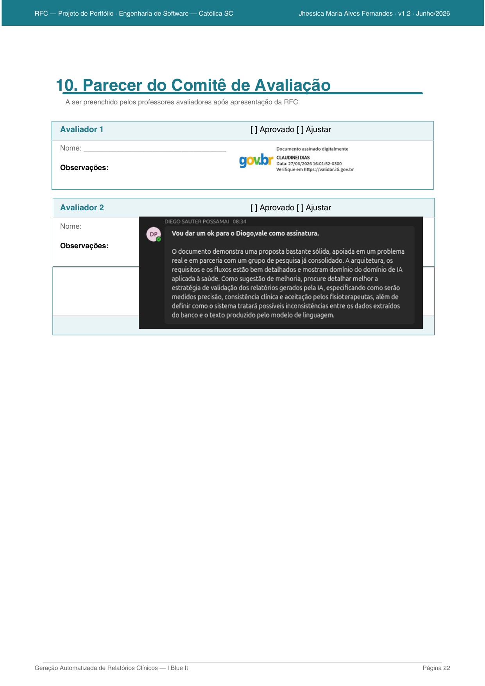
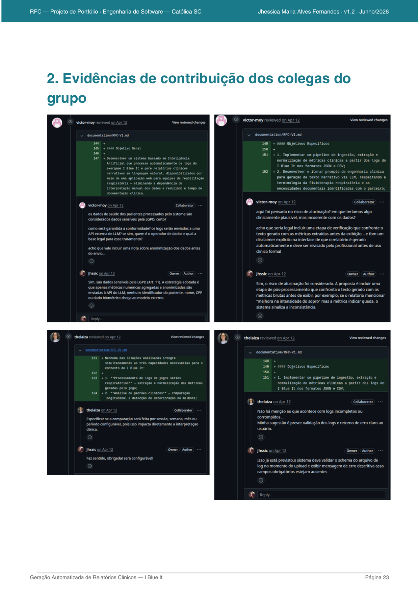
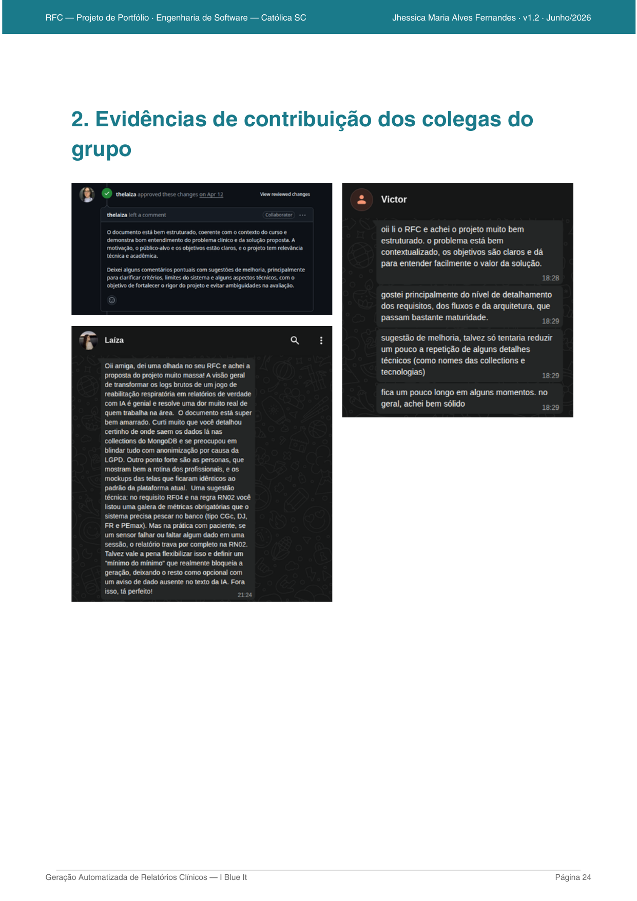
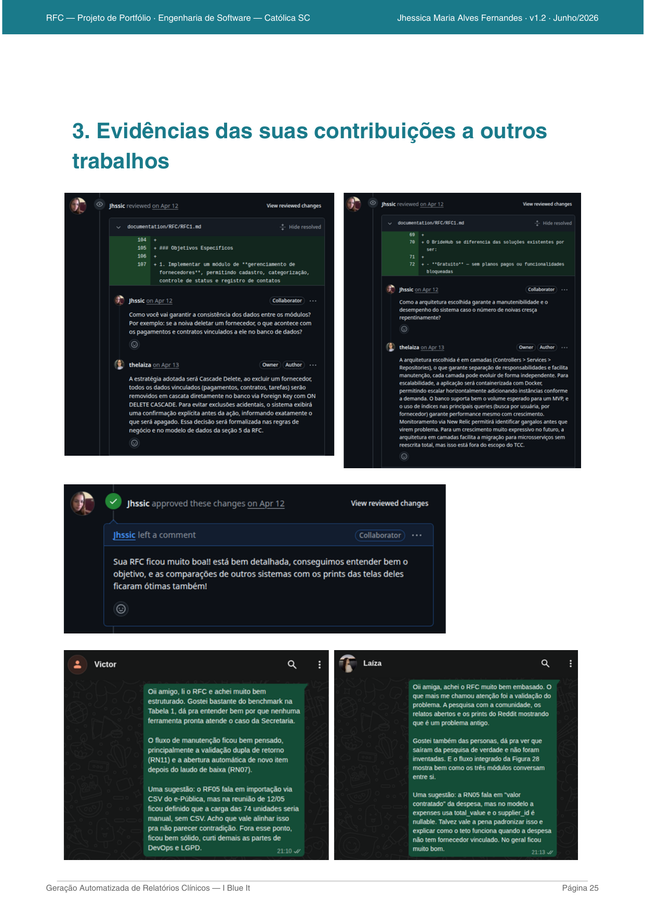

# Geração Automatizada de Relatórios Clínicos Narrativos para Reabilitação Respiratória a partir de Logs do Exergame I Blue It

**CATÓLICA SC — Engenharia de Software**
**RFC — Request for Comments · Versão 1.2**

| Campo | Valor |
| --- | --- |
| **Título** | Geração Automatizada de Relatórios Clínicos Narrativos para Reabilitação Respiratória a partir de Logs do Exergame I Blue It |
| **Linha de Projeto** | IA — Projetos com Inteligência Artificial |
| **Autor** | Jhessica Maria Alves Fernandes |
| **Data da Proposta** | 12/04/2026 |
| **Versão** | 1.2 — Junho/2026 |

---

## 1. Visão do Produto e Impacto (O Problema)

> Esta seção responde uma pergunta fundamental: este projeto resolve um problema real ou é apenas um exercício técnico?

### 1.1 Contexto e Problema

O **I Blue It** é um exergame para reabilitação respiratória — tendo sua Versão 1.0 desenvolvida por **Grimes et al.** na **UDESC (Universidade do Estado de Santa Catarina)** (Grimes et al., 2018). Atualmente, após sucessivas melhorias, o I Blue It encontra-se na Versão 5.0 (Dias, 2023). No jogo, o paciente usa a respiração com auxílio de um dispositivo **PITACO** para controlar elementos visuais na tela. Este projeto é desenvolvido no contexto do curso de Engenharia de Software da **Católica SC**.

A cada sessão, o sistema registra dados de desempenho armazenados no banco de dados **MongoDB Atlas** (Cluster-iblueit-v5), distribuídos nas collections: `calibrationoverviews`, `plataformoverviews`, `gameparameters`, `minigameoverviews`, `playsessions`, `flowdatadevices` e `pacients`. Esses dados representam um acervo longitudinal valioso do comportamento respiratório e da evolução clínica de cada paciente.

O problema central é a **ausência de qualquer mecanismo que transforme esses dados em documentação clínica interpretável**. Atualmente:

- Os dados ficam armazenados em collections do MongoDB Atlas (Cluster-iblueit-v5), sem tratamento ou síntese para uso clínico;
- O fisioterapeuta responsável precisa acessar manualmente esses dados, interpretar as métricas numericamente e **redigir à mão** o relatório de evolução clínica;
- Não há padronização de formato, periodicidade ou completude entre os relatórios produzidos por diferentes profissionais.

**Consequências práticas dessa lacuna:**

- Tempo expressivo gasto em documentação manual — estimado em 30 a 45 minutos por semana por profissional;
- Qualidade e completude dos registros variam entre profissionais e ao longo do tempo;
- A maior parte dos dados coletados nunca é formalmente incorporada à documentação clínica;
- Impossibilidade de identificar, de forma rápida e padronizada, tendências de melhora ou deterioração.

### 1.2 Origem da Demanda e Evidências

O projeto está vinculado ao **Grupo de Pesquisa em Reabilitação Respiratória da UDESC**. A conexão se dá por meio do **Prof. Claudinei Dias**, orientador deste projeto na Católica SC e pesquisador com doutorado na UDESC, com publicações vinculadas ao I Blue It entre 2020 e 2024.

**Principais dores identificadas em entrevista com o grupo parceiro:**

- Ausência de ferramenta que transforme os dados do MongoDB do I Blue It em documentação clínica estruturada;
- Fisioterapeutas relatam dificuldade em acessar e interpretar os dados brutos das collections;
- Os dados raramente são integrados aos registros clínicos formais por falta de tempo e ferramentas;
- Não há como visualizar rapidamente a evolução de um paciente ao longo de semanas.

**Evidências concretas do interesse do parceiro:**

- Publicações do grupo entre 2018–2024 mencionam explicitamente a necessidade de ferramentas de analytics para o I Blue It (Santos et al., 2020; Dias et al., 2020);
- O mapeamento sistemático de Dias et al. (2020) identificou ausência de sistemas de geração automatizada de relatórios clínicos narrativos integrados a jogos sérios respiratórios;
- A tese de doutorado de Dias (2024) aponta a documentação clínica automatizada como principal lacuna a endereçar.

### 1.3 Análise de Soluções Existentes (Benchmark)

| Solução | Pontos Fortes | Limitações |
| --- | --- | --- |
| iHealth Explorer | Interface simples; histórico gráfico | Sem narrativa clínica; sem integração com jogos sérios |
| Apple ResearchKit | Open source; coleta estruturada de sintomas | Sem relatório narrativo; inserção manual pelo paciente |
| Bingham et al. | Integra sopro ao jogo; coleta dados respiratórios | Sem módulo de relatório para clínicos |
| Vagg et al. | Analytics de jogo + alertas; ferramenta web clínica | Sem narrativa; alertas binários; sem exportação PDF |
| Nuance DAX | Geração de texto clínico via IA de alta qualidade | Sem integração com jogos sérios; custo inviável |

**Diferencial do Projeto**

Nenhuma solução integra simultaneamente: processamento de dados de collections MongoDB de jogos sérios respiratórios, análise de padrões clínicos e geração de relatório narrativo em linguagem natural via LLM. Esta solução será **de código aberto** e implementada diretamente no ecossistema I Blue It 5.0 existente.

### 1.4 Público-Alvo

- **Fisioterapeuta / Equipe Multidisciplinar:** Usuário principal. Acessa a nova aba 'Relatório Clínico' no menu I Blue It da plataforma Health InfoCharts, consulta relatórios gerados por IA, acompanha evolução histórica e configura alertas. Nível técnico: médio.
- **Paciente:** Usuário do exergame I Blue It que realiza as sessões de reabilitação. Os dados gerados alimentam o sistema de relatórios via MongoDB Atlas.

### 1.5 Objetivos do Projeto

**Objetivo Geral**

Desenvolver um módulo de geração automatizada de relatórios clínicos narrativos integrado ao ecossistema I Blue It 5.0, processando dados das collections MongoDB existentes (Cluster-iblueit-v5) e gerando texto via LLM, disponibilizado como nova feature na plataforma Health InfoCharts.

**Objetivos Específicos**

1. Implementar uma Azure Function (`GenerateClinicalReport`) no `iblueit-server-side` que consulte as collections MongoDB e chame a API do LLM via `URL_API_IA`;
2. Desenvolver prompts de engenharia clínica para geração de texto narrativo via LLM, usando as métricas das Tabelas 26 e 27 de Dias (2024);
3. Criar as telas de Relatório Clínico no frontend `iblueit-health-Infocharts` (React), com navegação por breadcrumb e abas;
4. Implementar sistema de alertas configuráveis por paciente baseado nas métricas do MongoDB;
5. Validar os relatórios gerados junto a pelo menos dois profissionais de saúde do grupo parceiro.

### 1.6 Métricas de Sucesso (KPIs)

| KPI | Meta |
| --- | --- |
| Tempo de geração do relatório após acionamento | ≤ 30 segundos |
| Avaliação de qualidade narrativa por fisioterapeutas (Likert 1–5) | ≥ 4,0 |
| Cobertura de métricas extraídas do MongoDB | 100% das métricas das Tabelas 26 e 27 |
| Precisão na detecção de alertas clínicos (vs. avaliação manual) | ≥ 85% |
| Adoção de profissionais de saúde nos primeiros 30 dias | ≥ 2 profissionais ativos |

---

## 2. Engenharia de Requisitos

> Esta seção define o que o sistema fará. Evite descrições vagas.

### 2.1 Personas

**Persona 1 — Dra. Ana, Fisioterapeuta Respiratória**

| | |
| --- | --- |
| **Contexto** | Ana tem 34 anos e coordena o acompanhamento de 15 pacientes com DPOC. Utiliza a plataforma I Blue It Health InfoCharts para acompanhar dados das collections `calibrationoverviews` e `plataformoverviews`. |
| **Objetivos** | Gerar relatórios clínicos automaticamente sem precisar acessar o MongoDB manualmente; identificar rapidamente pacientes com deterioração; ter registros padronizados para discussão em equipe. |
| **Dificuldades** | Perde 30–45 min/semana interpretando dados brutos do MongoDB; sem ferramenta que unifique dados de múltiplas collections em um relatório legível. |

**Persona 2 — Prof. Carlos, Pesquisador do Grupo I Blue It**

| | |
| --- | --- |
| **Contexto** | Carlos tem 48 anos e coordena o grupo de pesquisa. Supervisiona coleta de dados de múltiplos pacientes distribuídos nas collections do MongoDB Atlas (Cluster-iblueit-v5). |
| **Objetivos** | Obter sínteses consolidadas das collections; identificar padrões populacionais; gerar evidências de eficácia do jogo para publicação. |
| **Dificuldades** | Dados distribuídos em múltiplas collections sem ferramenta de consolidação; análise manual inviável para amostras maiores. |

**Persona 3 — João, Técnico de Fisioterapia**

| | |
| --- | --- |
| **Contexto** | João tem 27 anos e aplica as sessões com o I Blue It via dispositivo PITACO. Não tem acesso direto ao MongoDB. |
| **Objetivos** | Consultar rapidamente o relatório mais recente do paciente antes de cada sessão; verificar alertas ativos no dashboard. |
| **Dificuldades** | Depende de informações verbais da Dra. Ana; sem acesso fácil ao histórico clínico do paciente na plataforma. |

### 2.2 Casos de Uso Principais

- **UC01 — Gerar relatório clínico** — o sistema consulta as collections MongoDB do paciente e aciona o LLM para gerar o relatório narrativo.
- **UC02 — Visualizar relatório atual** — o profissional acessa a aba 'Relatório atual' e lê o relatório gerado, com destaque para alertas ativos.
- **UC03 — Consultar histórico** — o profissional visualiza relatórios anteriores na aba 'Histórico' com filtro por data.
- **UC04 — Ver gráficos de evolução** — o profissional visualiza gráficos longitudinais das métricas DJ, CGc e FR na aba 'Gráficos'.
- **UC05 — Exportar PDF** — o profissional exporta o relatório em PDF para inclusão no prontuário.
- **UC06 — Configurar alertas** — o profissional configura critérios de alerta por paciente na aba 'Alertas'.

### 2.3 Requisitos Funcionais (RF)

| # | Descrição |
| --- | --- |
| **RF01** | O sistema deve permitir que o profissional autenticado acesse a nova aba 'Relatório Clínico' no menu I Blue It da plataforma Health InfoCharts. |
| **RF02** | O sistema deve consultar automaticamente as collections MongoDB do paciente (`calibrationoverviews`, `plataformoverviews`, `gameparameters`, `playsessions`) via Azure Function para gerar o relatório. |
| **RF03** | O sistema deve validar a existência de dados suficientes nas collections antes de acionar o LLM, exibindo mensagem descritiva caso dados mínimos estejam ausentes. |
| **RF04** | O sistema deve extrair e processar as seguintes métricas geradas pelo exergame, conforme Tabela 27 de Dias (2024): **CGc** (Carga Corrente — `gameparameters`), **DJ** (Desempenho do Jogador — `plataformoverviews`) e **PJ** (Pontos da Jogada — `plataformoverviews`). |
| **RF05** | O sistema deve gerar automaticamente um relatório clínico narrativo em português via LLM, acessado pela Azure Function `GenerateClinicalReport` via variável `URL_API_IA`. |
| **RF06** | O sistema deve exibir o relatório na aba 'Relatório atual' com navegação por breadcrumb (← Pacientes › PAC-XXX › Relatório Clínico) e abas (Relatório atual · Histórico · Gráficos · Alertas · Gerar relatório). |
| **RF07** | O sistema deve exibir gráficos longitudinais das métricas DJ, CGc e FR na aba 'Gráficos', com filtro de período e indicação visual de pontos com alerta ativo. |
| **RF08** | O sistema deve permitir que o profissional exporte o relatório em formato PDF. |
| **RF09** | O sistema deve detectar automaticamente critérios de deterioração configuráveis e exibir alertas no relatório e no dashboard, com badge de contagem na aba 'Alertas'. |
| **RF10** | O sistema deve permitir que o profissional configure critérios de alerta por paciente (métrica, condição e número de sessões consecutivas) na aba 'Alertas'. |
| **RF11** | O sistema deve manter histórico completo de relatórios gerados por paciente, acessível na aba 'Histórico' com filtro por data. |
| **RF12** | O sistema deve registrar log de auditoria de todas as gerações de relatório. |

### 2.4 Requisitos Não Funcionais (RNF)

| # | Descrição |
| --- | --- |
| **RNF01** | O tempo total de geração do relatório (consulta MongoDB + chamada LLM + exibição) não deve ultrapassar 30 segundos. |
| **RNF02** | O sistema deve ser integrado ao frontend `iblueit-health-Infocharts` (React) e ao backend `iblueit-server-side` (Node.js + Azure Functions), sem quebrar funcionalidades existentes. |
| **RNF03** | Os dados dos pacientes consultados no MongoDB devem continuar anonimizados — sem nome, CPF ou dados biométricos diretos enviados ao LLM. |
| **RNF04** | A interface deve seguir o mesmo padrão visual da plataforma Health InfoCharts (dark sidebar `#0f1117`, React, Tabler Icons). |
| **RNF05** | O código-fonte deve ser disponibilizado em repositório público no GitHub sob licença MIT. |
| **RNF06** | O sistema deve suportar múltiplos terapeutas autenticados simultaneamente sem degradação de desempenho. |
| **RNF07** | A autenticação deve utilizar o mesmo mecanismo JWT já implementado no `iblueit-server-side` (collection `useraccounts`). |
| **RNF08** | Em caso de falha na API do LLM (`URL_API_IA`), o sistema deve exibir mensagem de erro e permitir nova tentativa sem perda dos dados consultados. |

### 2.5 Regras de Negócio

- **RN01:** Apenas usuários autenticados com role `'Administrator'` ou `'Therapist'` (collection `useraccounts`) podem gerar e visualizar relatórios clínicos.
- **RN02:** Um relatório só pode ser gerado se o MongoDB contiver dados suficientes nas collections obrigatórias do paciente, conforme métricas da Tabela 26 de Dias (2024): FR (`calibrationoverviews`), PEmax, PImax (`calibrationoverviews`), TEmax, TImax (`calibrationoverviews`), FLi, FLe (`flowdatadevices`), SpO2min (`calibrationoverviews`) e EB (`plataformoverviews`).
- **RN03:** O texto narrativo gerado pelo LLM é sugestivo. Todo relatório deve exibir: *"Este relatório foi gerado automaticamente por IA e deve ser revisado pelo profissional responsável antes de ser incorporado ao prontuário clínico."*
- **RN04:** Um alerta é disparado quando o critério configurado é atingido por 5 sessões consecutivas por padrão (configurável por paciente).
- **RN05:** O histórico de relatórios não pode ser excluído — apenas arquivado — preservando o rastro clínico para auditoria.
- **RN06:** No primeiro relatório de um paciente, o sistema gera o texto sem análise comparativa, indicando que é a sessão de referência inicial.

### 2.6 Fora do Escopo

- Substituição ou modificação das collections MongoDB existentes do I Blue It;
- Integração com sistemas de prontuário eletrônico externos (HIS/EHR);
- Geração de relatórios em tempo real durante a sessão de jogo;
- Aplicativo mobile independente para o profissional de saúde;
- Prescrição ou recomendação clínica automatizada com caráter normativo;
- Suporte a idiomas além do português brasileiro na versão inicial.

---

## 3. Fluxos e Comportamento do Sistema

Participantes: Fisioterapeuta → React Frontend (`iblueit-health-Infocharts`) → Azure Function (`iblueit-server-side`) → MongoDB Atlas (Cluster-iblueit-v5) → API LLM (`URL_API_IA`) → Serviço de Alertas

Os diagramas Mermaid desta seção estão disponíveis na pasta `docs/diagramas/` do repositório e renderizam automaticamente no GitHub.

### 3.1 Fluxo Principal do Usuário

| Etapa | Descrição |
| --- | --- |
| **Login** | Profissional acessa com e-mail e senha (collection `useraccounts`). Credenciais inválidas exibem mensagem de erro. |
| **Dashboard** | Lista de pacientes com indicadores de alerta (Ativo / Normal). Botão para gerar relatório. |
| **Menu I Blue It** | Profissional expande o menu I Blue It e seleciona 'Relatório Clínico'. |
| **Seleção do paciente** | Profissional seleciona o paciente via breadcrumb ou dashboard. |
| **Aba Gerar relatório** | Seleciona período, dispositivo (Pitaco/Mano/Cinta) e aciona processamento. |
| **Azure Function** | `GenerateClinicalReport` consulta MongoDB (Cluster-iblueit-v5) nas collections relevantes. |
| **Chamada ao LLM** | Backend chama `URL_API_IA` com prompt estruturado + métricas anonimizadas. |
| **Verificação de coerência** | Texto gerado é confrontado com as métricas numéricas antes de exibir. |
| **Aba Relatório atual** | Relatório exibido com alerta (se houver), resumo, análise comparativa e dados brutos. |
| **Exportação** | Profissional pode exportar o relatório em PDF via botão no topo da aba. |

### 3.2 Diagrama de Casos de Uso

| Ator | Casos de Uso |
| --- | --- |
| Fisioterapeuta | UC01 · UC02 · UC03 · UC04 · UC05 · UC06 |
| Técnico de Fisioterapia | UC02 · UC03 |
| Pesquisador | UC02 · UC03 · UC04 |
| Administrador | Todos + gerenciar usuários (`useraccounts`) |

> UC01 (Gerar) aciona UC02 (Visualizar). O sistema consulta MongoDB e chama `URL_API_IA` automaticamente.

### 3.3 Diagrama de Sequência — Geração de Relatório

| Passo | Descrição |
| --- | --- |
| FT → React | Acessa aba 'Gerar relatório', seleciona período e dispositivo |
| React → AzureFunc | `POST /api/GenerateClinicalReport` `{patientId, period, device}` |
| AzureFunc → MongoDB | Consulta `calibrationoverviews`, `plataformoverviews`, `gameparameters`, `playsessions` |
| [Alt] Dados insuficientes | MongoDB retorna vazio → AzureFunc → React: erro descritivo |
| [Alt] Dados disponíveis | MongoDB retorna métricas estruturadas do paciente |
| AzureFunc → LLM | `POST URL_API_IA` `{prompt clínico + métricas anonimizadas}` |
| [Alt] LLM disponível | LLM retorna texto narrativo → AzureFunc verifica coerência → persiste relatório |
| [Alt] LLM indisponível | AzureFunc → React: erro 503 + mensagem de nova tentativa |
| AzureFunc → Alertas | Verifica critérios configurados para o paciente |
| [Alt] Alerta atingido | Persiste `AlertRecord` → React exibe banner de destaque + badge na aba |
| [Alt] Sem alerta | React → FT: exibe relatório narrativo na aba 'Relatório atual' |

### 3.4 Fluxos Alternativos

- **FA01 — Collections sem dados suficientes:** O sistema valida a existência de dados nas collections antes de acionar o LLM. Se insuficientes, exibe mensagem descritiva indicando quais collections estão vazias para o período selecionado.
- **FA02 — Dados parcialmente ausentes:** Se algumas métricas estão ausentes em collections não obrigatórias, o sistema prossegue com as métricas disponíveis e indica no relatório quais campos não puderam ser consultados.
- **FA03 — Falha na `URL_API_IA`:** Azure Function mantém `status=pending`, exibe mensagem de falha e permite nova tentativa sem necessidade de reconfigurar o período.
- **FA04 — Primeiro relatório do paciente:** LLM recebe via prompt que é a sessão de referência inicial (sem histórico anterior) e gera o relatório sem análise comparativa.
- **FA05 — Critério de alerta atingido:** Serviço de Alertas persiste `AlertRecord` no MongoDB. Banner de destaque exibido no topo do relatório e badge de contagem atualizado na aba 'Alertas'.

---

## 4. Mockups e Experiência do Usuário (UX)

Protótipo navegável disponível em: **https://www.figma.com/design/tbQyR10uUZVW3RoBAiMhuh/i-blue-it?node-id=2506-90**

As telas abaixo foram desenvolvidas no estilo real da plataforma I Blue It Health InfoCharts (dark sidebar `#0f1117`, React + Tabler Icons).

### 4.1 Fluxo de Navegação

| De | Para |
| --- | --- |
| Login | → Dashboard (lista de pacientes com badges de alerta) |
| Dashboard | → Perfil do Paciente (breadcrumb: ← Pacientes › PAC-XXX) |
| Perfil · aba Relatório atual | → Visualiza narrativa + cards DJ/PJ/CGc + tabela de métricas |
| Perfil · aba Histórico | → Lista semanal com badges Ativo/Normal + filtro de data |
| Perfil · aba Gráficos | → Gráficos longitudinais DJ, CGc, FR com filtro de período |
| Perfil · aba Alertas | → Formulário de critérios configuráveis por métrica |
| Perfil · aba Gerar relatório | → Seleção de período + dispositivo + acionamento do LLM |
| Relatório atual | → Exportar PDF |

### 4.2 Wireframes e Mockups das Telas

**Tela 1 — Relatório Clínico Atual (aba: Relatório atual)**


Tela central da feature. Breadcrumb de navegação no topo (← Pacientes › PAC-002 › Relatório Clínico). Banner de alerta ativo em amarelo quando presente. Cards com métricas DJ, PJ e CGc. Blocos de Resumo da sessão e Análise comparativa gerados pelo LLM. Tabela de dados brutos com a collection MongoDB de origem de cada métrica. Disclaimer de revisão clínica obrigatória. Botão Exportar PDF no topo.

**Tela 2 — Histórico de Relatórios (aba: Histórico)**


Lista cronológica de todos os relatórios gerados para o paciente. Colunas: Semana, Período, Resumo, Alerta (badge Ativo/Normal) e botão Abrir. Filtro de data inicial e final. A aba 'Alertas' exibe badge com contagem de alertas ativos.

**Tela 3 — Evolução Longitudinal (aba: Gráficos)**


Três gráficos de linha: DJ (`plataformoverviews`) com pontos vermelhos em sessões com alerta, CGc (`gameparameters`) com linha estável, FR (`calibrationoverviews`) com faixa de referência [12–20 rpm] em verde. Filtro de período no canto superior direito.

**Tela 4 — Configuração de Alertas (aba: Alertas)**


Formulário de critérios configuráveis por paciente. Cada critério define: Métrica (dropdown com DJ, PJ, CGc, FR, EB, PEmax, PImax), Condição (Deterioração consecutiva / Queda percentual / Abaixo do valor) e número de sessões consecutivas para disparo. Padrão: 5 sessões. Suporta múltiplos critérios com remoção individual.

**Tela 5 — Gerar Novo Relatório (aba: Gerar relatório)**


Seleção de período de referência (última semana, últimas 2 semanas, último mês, personalizado) e dispositivo (Pitaco/Mano/Cinta). Lista das collections MongoDB consultadas automaticamente: `calibrationoverviews`, `plataformoverviews`, `gameparameters`, `playsessions`, `pacients`, `minigameoverviews`. Botão 'Processar e gerar relatório' aciona a Azure Function.

### 4.3 Padrão Visual da Plataforma

| Elemento | Especificação |
| --- | --- |
| Cor da sidebar | `#0f1117` (fundo) · `#1f2230` (divisores) · `#1a3a6e` (item ativo) |
| Cor de destaque | `#2563eb` (azul) · `#3b82f6` (borda ativa sidebar) |
| Cor de alerta | `#fef3c7` (fundo) · `#d97706` (texto) — padrão da plataforma |
| Typography | Inter, -apple-system · 12–15px para conteúdo |
| Ícones | Tabler Icons Webfont (`@tabler/icons-webfont@2.44.0`) — já utilizado |
| Framework | React (`iblueit-health-Infocharts`) · Azure Functions Node.js (`iblueit-server-side`) |

---

## 5. Arquitetura do Sistema

### 5.1 Ecossistema I Blue It 5.0

A nova feature de Relatório Clínico é implementada **dentro do ecossistema existente**, sem criar novos serviços independentes:

| Componente | Repositório | Tecnologia | Papel na feature |
| --- | --- | --- | --- |
| Frontend | `iblueit-health-Infocharts` | React + JavaScript | Novas telas na rota `/relatorios-clinicos` com tabs e breadcrumb |
| Backend | `iblueit-server-side` | Node.js + Azure Functions | Nova função `GenerateClinicalReport` que consulta MongoDB e chama LLM |
| Banco de dados | MongoDB Atlas | Cluster-iblueit-v5 | Collections existentes consultadas (sem criação de novas collections) |
| API de IA | `URL_API_IA` (local.settings.json) | Python FastAPI | Nova API Python que recebe métricas e retorna texto narrativo via LLM |

### 5.2 Collections MongoDB Utilizadas

Banco: **IBLUEIT** · Cluster: **Cluster-iblueit-v5** · Banco de dados: **MongoDB Atlas**

| Collection | Campos relevantes para o relatório | Métricas extraídas |
| --- | --- | --- |
| `calibrationoverviews` | `pacientId`, `calibrationValue`, `calibrationExercise`, `_gameToken`, `created_at` | FR, PEmax, PImax, TEmax, TImax, SpO2min |
| `plataformoverviews` | `pacientId`, `devices[]`, `playStart`, `playFinish`, `score`, `scoreRatio`, `TargetsSuccess`, `TargetsFails`, `DJ`, `EB` | DJ, PJ, EB |
| `gameparameters` | `pacientId`, `stageId`, `phase`, `level`, `ObjectSpeedFactor`, `Loops` | CGc (carga corrente) |
| `playsessions` | `pacientId`, `sessionNumber`, `created_at` | Número de sessões, frequência de uso |
| `minigameoverviews` | `pacientId`, `minigameName`, `respiratoryExercise`, `flowDataRounds[]` | Minigame ativo, exercício respiratório |
| `flowdatadevices` | `_gameToken`, `flowDataDevices[]`, `created_at` | FLi, FLe (fluxos de inspiração/expiração) |
| `pacients` | `name`, `birthday`, `sex`, `condition`, `weight`, `height`, `currentBorgScale` | Dados do paciente para contexto do prompt |

### 5.3 Nova Azure Function — GenerateClinicalReport

Estrutura da nova função no repositório `iblueit-server-side`:

```
iblueit-server-side/
└── GenerateClinicalReport/
    ├── index.js       ← handler principal
    └── function.json  ← definição da rota HTTP
```

A função recebe `patientId`, `period` e `device`, consulta as collections MongoDB via Mongoose, monta o prompt clínico e chama `URL_API_IA` (variável já existente no `local.settings.json`).

### 5.4 Principais Componentes

- **Azure Function GenerateClinicalReport:** Orquestra as consultas MongoDB nas collections relevantes, monta o objeto de métricas estruturado e chama `URL_API_IA`. Persiste o relatório gerado e verifica critérios de alerta.
- **API Python (`URL_API_IA`):** FastAPI em Python que recebe as métricas anonimizadas do paciente, constrói o prompt clínico via template parametrizado e chama a API do LLM (Claude ou GPT). Retorna o texto narrativo estruturado.
- **Serviço de Alertas:** Módulo Node.js que verifica os critérios configurados para o paciente após cada geração de relatório. Persiste `AlertRecord` no MongoDB e atualiza o dashboard.
- **Frontend React — Módulo Relatório Clínico:** Novas telas adicionadas ao `iblueit-health-Infocharts` com: breadcrumb de navegação, sistema de abas (Relatório atual · Histórico · Gráficos · Alertas · Gerar relatório), gráficos longitudinais e exportação PDF.

### 5.5 Stack Tecnológica

| Tecnologia | Justificativa |
| --- | --- |
| Node.js + Azure Functions (`iblueit-server-side`) | Já utilizado no ecossistema. Padrão de desenvolvimento do projeto I Blue It 5.0. |
| MongoDB Atlas — Mongoose | Já utilizado. Collections existentes consultadas sem modificação de schema. |
| React + JavaScript (`iblueit-health-Infocharts`) | Já utilizado no frontend. Novas telas seguem o mesmo padrão de componentes. |
| Python + FastAPI (`URL_API_IA`) | Variável `URL_API_IA` já existe no `local.settings.json`, prevendo uma API IA em Python. |
| API LLM — Claude Haiku / GPT-4o-mini | Custo < R$ 0,05 por relatório. Suportam prompts longos e terminologia clínica. |
| WeasyPrint (exportação PDF) | Geração de PDFs a partir do HTML do relatório, sem serviços externos. |
| Tabler Icons (`@tabler/icons-webfont@2.44.0`) | Já utilizado na plataforma. Mantém consistência visual. |

---

## 6. Segurança e Privacidade

O sistema aproveita a infraestrutura de segurança já existente no I Blue It 5.0 e adiciona controles específicos para a geração de relatórios clínicos.

**Medidas de segurança implementadas:**

- Autenticação via JWT já implementada no `iblueit-server-side` (collection `useraccounts`) — reutilizada sem modificações;
- Apenas usuários com role `'Administrator'` ou `'Therapist'` podem acionar a Azure Function `GenerateClinicalReport`;
- Apenas métricas numéricas anonimizadas (sem `patientId`, nome ou dados biométricos diretos) são enviadas à API do LLM via `URL_API_IA`;
- Comunicação via HTTPS com certificado válido (já configurado no Azure Functions);
- Log de auditoria de todas as gerações de relatório (timestamp, `patientId` interno, `userId` responsável).

### 6.1 Privacidade e LGPD

- **Dados consultados no MongoDB:** Métricas numéricas de desempenho (`calibrationoverviews`, `plataformoverviews`, `gameparameters`) e dados demográficos básicos (collection `pacients`: age, sex, condition, weight, height). Nenhum CPF ou dado de identificação direta é processado pelo LLM.
- **Dados enviados ao LLM:** Somente métricas numéricas agregadas e contexto clínico genérico (condição, idade, dispositivo). O `patientId` não é enviado — apenas um código de sessão temporário.
- **Base legal (LGPD):** Pesquisa científica e assistência à saúde — Art. 11, II, 'b' e 'c' da LGPD.
- **Direito de remoção (Art. 18):** Administrador pode arquivar dados clínicos de um paciente mediante solicitação. Remoção definitiva executada em até 72 horas, documentada em audit log.

---

## 7. Planejamento do Projeto

| Marco | Descrição | Prazo |
| --- | --- | --- |
| M1 | Estudo do ecossistema I Blue It 5.0: clone dos repos `iblueit-server-side` e `iblueit-health-Infocharts`, mapeamento das collections MongoDB e das rotas existentes | Semana 1–2 |
| M2 | Desenvolvimento da API Python (`URL_API_IA`): FastAPI com endpoint de geração de relatório, engenharia de prompt clínico e integração com LLM | Semana 3–5 |
| M3 | Desenvolvimento da Azure Function `GenerateClinicalReport`: consulta MongoDB, chamada `URL_API_IA` e persistência do relatório | Semana 6–7 |
| M4 | MVP do frontend: novas telas React no `iblueit-health-Infocharts` com navegação por abas e breadcrumb | Semana 8–10 |
| M5 | Validação com profissionais de saúde — Etapa 1: sessão de feedback estruturado com escala Likert | Semana 11 |
| M6 | Ajustes pós-validação, sistema de alertas e exportação PDF | Semana 12 |
| M7 | Validação com dados reais do MongoDB — Etapa 2 | Semana 13 |
| M8 | Documentação final, testes, deploy e entrega | Semana 14 |

---

## 8. Referências

- AGUILAR, J.G. et al. **Respiration Tracking Using the Wii Remote Game-Controller**. In: *Proceedings of Medical Informatics in a United and Healthy Europe*, 2011. p. 455–459.
- DIAS, C. et al. **Uso da Inteligência Artificial em Jogos Digitais aplicados à Reabilitação Respiratória: um Mapeamento Sistemático da Literatura**. UDESC, 2020.
- DIAS, C. et al. **A MM Its Use in Respiratory Rehabilitation**. UDESC, 2023.
- DIAS, C. **Tese de Doutorado — publicada**. UDESC, 2024.
- GRIMES, D. et al. **O Processo de Design de um Sistema Biomédico com Jogo Sério e Dispositivo**. 2018.
- GRIMES, D. et al. **Sistema biomédico (com jogo sério e dispositivo especial) para reabilitação respiratória**. 2018.
- NERY, F. et al. **123-SGR: Uma Arquitetura para Jogos Sérios Multimodais para Reabilitação**. UDESC, 2020.
- SANTOS, R. et al. **I Blue It: Um Jogo Sério para auxiliar na Reabilitação Respiratória**. UDESC, 2018.
- SANTOS, R. et al. **Estendendo Jogos Sérios com a perspectiva de Serviço**. UDESC, 2020.
- UDESC-LARVA. **iblueit-health-Infocharts**. GitHub, 2024. Disponível em: https://github.com/UDESC-LARVA/iblueit-health-Infocharts
- UDESC-LARVA. **iblueit-server-side**. GitHub, 2024. Disponível em: https://github.com/UDESC-LARVA/iblueit-server-side
- VAGG, T. et al. **MHealth and Serious Game Analytics for Cystic Fibrosis Adults**. In: *2018 IEEE 31st International Symposium on Computer-Based Medical Systems*, 2018. p. 100–105. DOI: 10.1109/CBMS.2018.00025.

---

## 9. Apêndices

### Apêndice A — Estrutura do Relatório Narrativo Gerado

Cada relatório gerado automaticamente pela API Python (`URL_API_IA`) contém os seguintes blocos:

1. **Identificação** — código do paciente (`patientId` interno), dispositivo utilizado (Pitaco/Mano/Cinta) e período de referência;
2. **Resumo da sessão** — síntese em 2–3 parágrafos do desempenho consultado nas collections MongoDB;
3. **Análise comparativa** — comparação com períodos anteriores, com identificação de tendências de melhora ou deterioração nas métricas DJ, PJ, CGc, FR e EB;
4. **Indicadores de alerta** — destacados quando critérios configurados foram atingidos, com descrição da métrica e número de sessões consecutivas;
5. **Aviso de revisão** — texto fixo obrigatório: *"Este relatório foi gerado automaticamente por IA e deve ser revisado pelo profissional responsável antes de ser incorporado ao prontuário clínico."*;
6. **Dados brutos consolidados** — tabela com todas as métricas numéricas extraídas das collections MongoDB, com indicação da collection de origem de cada campo.

### Apêndice B — Repositórios e Licença

A feature será implementada via Pull Requests nos repositórios públicos do UDESC-LARVA e no repositório de portfólio da autora:

- **Frontend:** https://github.com/UDESC-LARVA/iblueit-health-Infocharts
- **Backend:** https://github.com/UDESC-LARVA/iblueit-server-side
- **Repositório do portfólio:** https://github.com/Jhssic/iblueit-clinical-reports
- **Playbook do Portfólio:** https://github.com/CatolicaSC-Portfolio/The-Portfolio-Playbook

---

## 10. Parecer do Comitê de Avaliação

> A ser preenchido pelos professores avaliadores após apresentação da RFC.



---

## Evidências de contribuição dos colegas do grupo





## Evidências das suas contribuições a outros trabalhos


