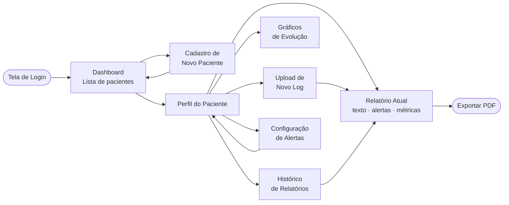
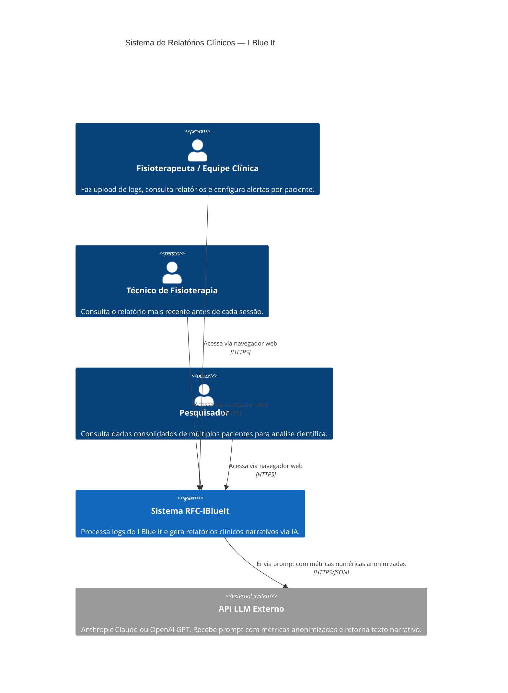
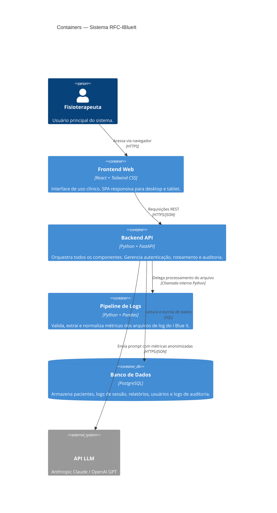
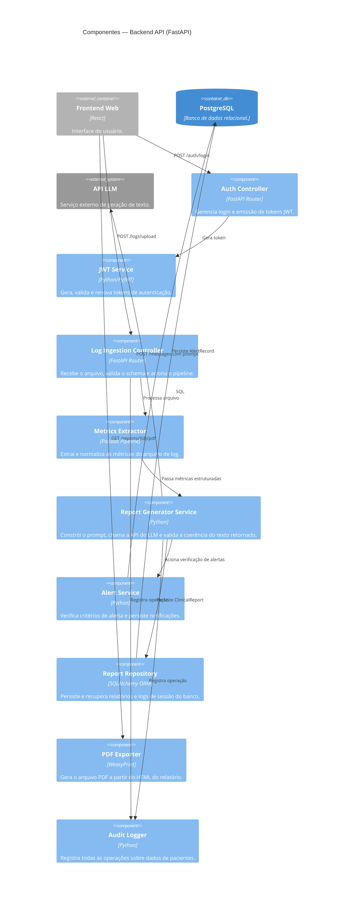
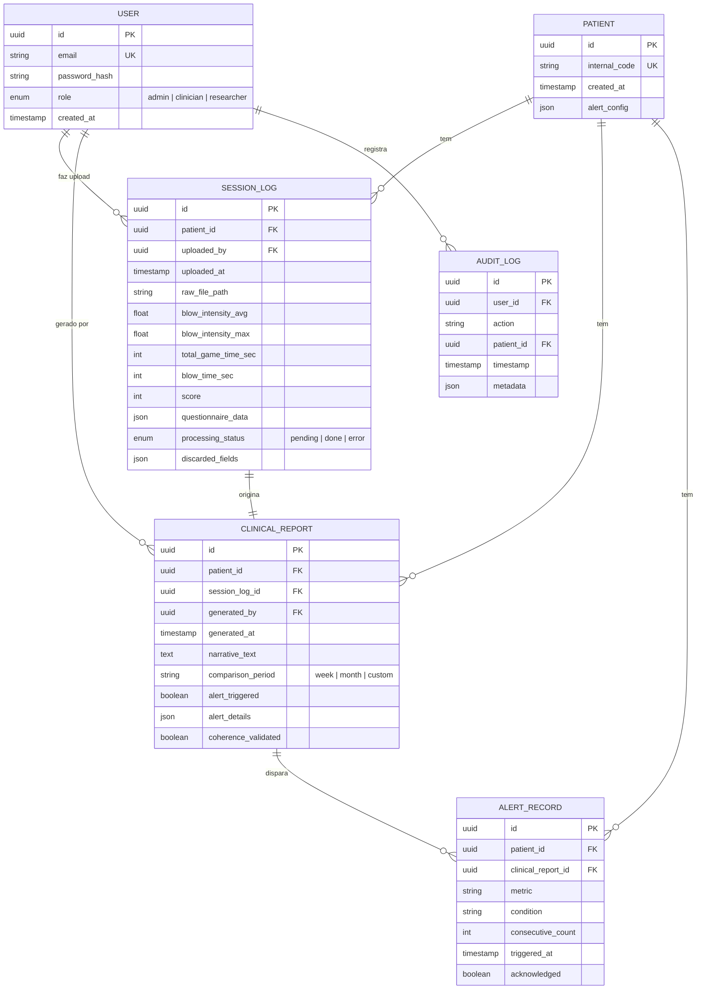

# RFC: Request for Comments — Projeto de Portfólio

**Engenharia de Software — Católica SC**

---

## Identificação

| Campo                            | Valor                                                                                                                        |
| -------------------------------- | ---------------------------------------------------------------------------------------------------------------------------- |
| **Título do Projeto**            | Geração Automatizada de Relatórios Clínicos Narrativos para Reabilitação Respiratória a partir de Logs do Exergame I Blue It |
| **Linha de Projeto (Direction)** | IA                                                                                                                           |
| **Autor**                        | Jhessica Maria Alves Fernandes                                                                                               |
| **Data da Proposta**             | 12/04/2026                                                                                                                   |
| **Versão**                       | 1.1                                                                                                                          |

---

## 1. Visão do Produto e Impacto (O Problema)

### 1.1 Contexto e Problema

O **I Blue It** é um exergame para reabilitação respiratória — tendo sua Versão 1.0 desenvolvido por **Grimes et al.** na **UDESC (Universidade do Estado de Santa Catarina)** (Grimes et al., 2018), atualmente, após sucessivas melhorias e adição de novos recursos, o I Blue It encontra-se na Versão 5.0 (Dias, 2023). No jogo, o paciente usa a respiração com auxílio de um dispositivo **PITACO** para controlar elementos visuais na tela — mecanismo que exercita a musculatura respiratória. Este projeto é desenvolvido no contexto do curso de Engenharia de Software da **Católica SC**.

A cada sessão, o sistema registra automaticamente um conjunto rico de dados de desempenho: intensidade média e máxima da respiração, tempo total de jogo, tempo efetivo da respiração, pontuação, frequência de uso semanal e respostas ao questionário de bem-estar. Esse volume de dados representa um acervo longitudinal valioso do comportamento respiratório e da evolução clínica de cada paciente.

O problema central é a **ausência de qualquer mecanismo que transforme esses dados em documentação clínica interpretável**. Atualmente:

- Os dados ficam armazenados em **arquivos de log brutos** (JSON/CSV) e Banco de Dados MongoDB, sem tratamento ou síntese;
- O fisioterapeuta responsável precisa acessar manualmente esses arquivos, interpretar as métricas numericamente e **redigir à mão** o relatório de evolução clínica do paciente;
- Não há padronização de formato, periodicidade ou completude entre os relatórios produzidos por diferentes profissionais.

**Consequências práticas dessa lacuna:**

- Tempo expressivo gasto em documentação manual — estimado em 30 a 45 minutos por semana por profissional — em detrimento do atendimento direto ao paciente;
- Qualidade e completude dos registros variam entre profissionais e ao longo do tempo;
- A maior parte dos dados coletados pelo jogo nunca é formalmente incorporada à documentação clínica;
- Impossibilidade de identificar, de forma rápida e padronizada, tendências de melhora ou deterioração no desempenho respiratório do paciente.

Vagg et al. (2018) demonstraram, em sistema similar desenvolvido para Fibrose Cística, que dados de desempenho em jogos sérios respiratórios correlacionam-se com indicadores clínicos relevantes — chegando a antecipar exacerbações antes de consultas presenciais. Esse potencial permanece **completamente inexplorado** no contexto do I Blue It pela ausência de uma camada de interpretação e documentação automatizada.

---

### 1.2 Origem da Demanda e Evidências

O projeto está vinculado ao **Grupo de Pesquisa em Reabilitação Respiratória da UDESC**, responsável pelo desenvolvimento e manutenção do exergame I Blue It (Grimes et al., 2018). A conexão com o grupo se dá por meio do **Prof. Claudinei Dias**, orientador deste projeto na Católica SC e pesquisador com doutorado na UDESC, com publicações vinculadas ao I Blue It entre 2020 e 2024.

Foi realizada **1 entrevista** com pesquisador do grupo de pesquisa parceiro. As principais dores identificadas foram:

- Ausência de ferramenta que transforme os logs do I Blue It em documentação clínica estruturada;
- Fisioterapeutas que acompanham os pacientes relatam dificuldade em acessar e interpretar os dados brutos do jogo;
- Os dados coletados pelo sistema raramente são integrados aos registros clínicos formais por falta de tempo e ferramentas;
- Não há como visualizar rapidamente a evolução de um paciente ao longo de semanas sem consolidar manualmente múltiplos arquivos de log.

Como evidências concretas do interesse do parceiro:

- Publicações do grupo entre 2018–2024 mencionam **explicitamente** a necessidade de ferramentas de analytics e documentação para o I Blue It (Santos et al., 2020; Dias et al., 2020);
- O mapeamento sistemático realizado por Dias et al. (2020) identificou ausência de sistemas de geração automatizada de relatórios clínicos narrativos integrados a jogos sérios respiratórios;
- A tese de doutorado publicada pelo grupo (Dias, 2024) aponta a documentação clínica automatizada como uma das principais lacunas a serem endereçadas em trabalhos futuros.

---

### 1.3 Análise de Soluções Existentes (Benchmark)

Foram investigadas cinco soluções existentes que atendem, parcialmente, ao mesmo problema.

#### iHealth Explorer Tool

- **Link:** https://ihealthgroup.com
- **Público-alvo:** Clínicos e pacientes em geral.
- **Funcionalidades principais:** Visualização de dados de saúde, gráficos históricos de métricas como pressão arterial, frequência cardíaca e glicemia.
- **Limitações:** Não gera texto narrativo clínico; não integra com jogos sérios ou dados de reabilitação respiratória; não possui módulo de alertas configuráveis por paciente.

#### Apple ResearchKit — Asthma Health (Mount Sinai)

- **Link:** https://apple.com/researchkit
- **Público-alvo:** Pacientes adultos com asma.
- **Funcionalidades principais:** Monitoramento de sintomas, coleta de dados via app, identificação de gatilhos de exacerbação.
- **Limitações:** Sem geração de relatório clínico narrativo; sem suporte a jogos terapêuticos; dados inseridos manualmente pelo paciente.

#### Breath Biofeedback Game — Bingham et al. (2010)

- **Link:** https://dl.acm.org/doi/10.1145/3706599.3720103
- **Público-alvo:** Crianças com Fibrose Cística.
- **Funcionalidades principais:** Biofeedback respiratório integrado a jogo; coleta de dados de sopro durante as sessões.
- **Limitações:** Sistema de pesquisa sem módulo de relatório para clínicos; dados coletados não são transformados em documentação clínica; sem histórico longitudinal por paciente.

#### MHealth CF Analytics — Vagg et al. (2018)

- **Link:** Literatura científica (IEEE CBMS 2018)
- **Público-alvo:** Adultos com Fibrose Cística e equipes clínicas.
- **Funcionalidades principais:** Analytics de dados de jogo sério respiratório, alertas automáticos por SMS para o paciente, ferramenta web para visualização pela equipe clínica.
- **Limitações:** Não gera narrativa clínica — apresenta apenas dados numéricos e gráficos; alertas são binários, sem texto interpretativo; sem exportação de relatório para o prontuário.

#### Nuance DAX

- **Link:** https://nuance.com
- **Público-alvo:** Médicos e equipes clínicas em geral.
- **Funcionalidades principais:** Transcrição automática de consultas, sumarização de notas clínicas via IA, integração com prontuários eletrônicos.
- **Limitações:** Não integra dados de jogos sérios ou sensores de reabilitação; custo elevado, inviável para projetos de pesquisa; focado em consultas presenciais.

#### Comparação entre Soluções

| Solução           | Pontos Fortes                                       | Limitações                                             |
| ----------------- | --------------------------------------------------- | ------------------------------------------------------ |
| iHealth Explorer  | Interface simples; histórico gráfico                | Sem narrativa clínica; sem integração com jogos sérios |
| Apple ResearchKit | Open source; coleta estruturada de sintomas         | Sem relatório narrativo; inserção manual pelo paciente |
| Bingham et al.    | Integra sopro ao jogo; coleta dados respiratórios   | Sem módulo de relatório para clínicos                  |
| Vagg et al.       | Analytics de jogo + alertas; ferramenta web clínica | Sem narrativa; alertas binários; sem exportação PDF    |
| Nuance DAX        | Geração de texto clínico via IA de alta qualidade   | Sem integração com jogos sérios; custo inviável        |

#### Diferencial do Projeto

Nenhuma das soluções analisadas integra simultaneamente as três capacidades necessárias para o contexto do I Blue It:

1. **Processamento de logs de jogos sérios respiratórios** — extração e normalização das métricas geradas pelo jogo;
2. **Análise de padrões clínicos** — comparação longitudinal e detecção de deterioração ou melhora;
3. **Geração de relatório narrativo em linguagem natural via LLM** — texto clínico estruturado, em português, adequado para inclusão no prontuário.

Adicionalmente, a solução será **de código aberto**, adaptável por outros grupos de pesquisa que utilizem jogos sérios para reabilitação respiratória.

---

### 1.4 Público-Alvo

O sistema será utilizado pelos seguintes perfis de usuários:

- **Fisioterapeuta / Equipe Multidisciplinar:** Profissional de saúde responsável pelo acompanhamento clínico dos pacientes em reabilitação respiratória. Realiza upload dos logs, consulta os relatórios gerados, acompanha a evolução histórica e configura critérios de alerta. É o usuário principal do sistema. Nível técnico: médio — familiaridade com computadores e sistemas web, sem conhecimento de programação ou análise de dados.

- **Paciente:** Usuário do exergame I Blue It que realiza as sessões de reabilitação respiratória. Os dados gerados durante suas sessões alimentam o sistema de relatórios.

---

### 1.5 Objetivos do Projeto

#### Objetivo Geral

Desenvolver um sistema baseado em Inteligência Artificial que processe automaticamente os logs do exergame I Blue It e gere relatórios clínicos narrativos em linguagem natural, disponibilizados por meio de uma aplicação web para equipes de reabilitação respiratória — eliminando a dependência de interpretação manual dos dados e reduzindo o tempo de documentação clínica.

#### Objetivos Específicos

1. Implementar um pipeline de ingestão, extração e normalização de métricas clínicas a partir dos logs do I Blue It nos formatos JSON e CSV;
2. Desenvolver e iterar prompts de engenharia clínica para geração de texto narrativo via LLM, respeitando a terminologia da fisioterapia respiratória e as necessidades documentais identificadas com o parceiro;
3. Construir uma API de backend que orquestre o processamento dos logs, a chamada ao LLM e o armazenamento dos relatórios gerados;
4. Desenvolver uma interface web para visualização de relatórios por paciente, com histórico gráfico de métricas e sistema de alertas configuráveis por critério clínico;
5. Validar os relatórios gerados junto a pelo menos dois profissionais de saúde do grupo de pesquisa parceiro, por meio de protocolo estruturado de avaliação com escala Likert.

---

### 1.6 Métricas de Sucesso (KPIs)

| KPI                                                                  | Meta                                    |
| -------------------------------------------------------------------- | --------------------------------------- |
| Tempo de geração do relatório após upload do log                     | ≤ 30 segundos                           |
| Avaliação de qualidade narrativa por fisioterapeutas (Likert 1–5)    | ≥ 4,0                                   |
| Cobertura de métricas extraídas do log                               | 100% das métricas definidas no escopo   |
| Precisão na detecção de alertas clínicos (vs. avaliação manual)      | ≥ 85%                                   |
| Adoção de profissionais de saúde nos primeiros 30 dias               | ≥ 2 profissionais ativos                |

---

## 2. Engenharia de Requisitos

### 2.1 Personas

#### Persona 1 — Dra. Ana, Fisioterapeuta Respiratória

| Atributo      | Descrição                                                                                                                                                                                                                                      |
| ------------- | ---------------------------------------------------------------------------------------------------------------------------------------------------------------------------------------------------------------------------------------------- |
| Contexto      | Ana tem 34 anos e coordena o acompanhamento de 15 pacientes com DPOC em um programa de reabilitação pulmonar vinculado ao grupo de pesquisa. Utiliza o I Blue It como ferramenta complementar às sessões presenciais e é responsável pela documentação clínica semanal de cada paciente. |
| Objetivos     | Documentar a evolução dos pacientes de forma eficiente; identificar rapidamente quem está deteriorando antes da próxima consulta; ter registros claros e padronizados para discussão em equipe multidisciplinar e para fins de pesquisa.        |
| Dificuldades  | Perde entre 30 e 45 minutos por semana abrindo arquivos de log manualmente e redigindo relatórios; os dados do jogo raramente entram nos registros clínicos formais por falta de tempo; não consegue visualizar tendências ao longo de semanas sem consolidar vários arquivos. |

#### Persona 2 — Prof. Carlos, Pesquisador e Coordenador do Grupo I Blue It

| Atributo      | Descrição                                                                                                                                                                                                       |
| ------------- | --------------------------------------------------------------------------------------------------------------------------------------------------------------------------------------------------------------- |
| Contexto      | Carlos tem 48 anos e coordena o grupo de pesquisa responsável pelo I Blue It. Supervisiona a coleta de dados de múltiplos pacientes em diferentes momentos do estudo e precisa de sínteses para embasar publicações científicas e relatórios de projeto. |
| Objetivos     | Obter sínteses consolidadas dos dados coletados; identificar padrões de evolução entre pacientes; gerar evidências quantitativas de eficácia do jogo para publicação.                                           |
| Dificuldades  | Os dados estão distribuídos em logs individuais sem ferramenta de consolidação; a análise manual é inviável para amostras com mais de 10 pacientes; não há histórico visual de evolução por paciente.           |

#### Persona 3 — João, Técnico de Fisioterapia

| Atributo      | Descrição                                                                                                                                              |
| ------------- | ------------------------------------------------------------------------------------------------------------------------------------------------------ |
| Contexto      | João tem 27 anos e aplica as sessões com o I Blue It diretamente com os pacientes. Não redige relatórios, mas precisa saber, antes de cada sessão, como o paciente evoluiu na semana anterior e se há algum ponto de atenção registrado. |
| Objetivos     | Consultar rapidamente o relatório mais recente do paciente; verificar se há alertas ativos antes de iniciar a sessão.                                  |
| Dificuldades  | Não tem acesso fácil ao histórico; depende de receber informações verbalmente da Dra. Ana, o que nem sempre acontece antes das sessões.                |

---

### 2.2 Casos de Uso Principais

1. **UC01** — Upload de log de sessão — o sistema sincroniza o log gerado pelo I Blue It (JSON ou CSV) para um paciente cadastrado no sistema.
2. **UC02** — Geração de relatório — o sistema processa o log, extrai as métricas, consulta o histórico do paciente e aciona o LLM para gerar o relatório clínico narrativo.
3. **UC03** — Visualização do relatório — o profissional acessa e lê o relatório gerado, com destaque automático para alertas ativos.
4. **UC04** — Consulta de histórico — o profissional visualiza a lista de relatórios anteriores e o gráfico de evolução de métricas de um paciente ao longo do tempo.
5. **UC05** — Exportação de relatório — o profissional exporta o relatório em PDF para inclusão no prontuário físico ou envio por e-mail.
6. **UC06** — Configuração de alertas — o profissional configura os critérios de alerta para um paciente específico (métrica, condição e número de registros consecutivos).
7. **UC07** — Cadastro de paciente — o profissional cadastra um novo paciente no sistema com código interno anonimizado.

---

### 2.3 Requisitos Funcionais (RF)

**RF01** — O sistema deve permitir que o profissional autenticado cadastre e gerencie pacientes com código interno anonimizado, sem armazenamento de dados identificáveis.

**RF02** — O sistema deve permitir upload de arquivos de log do I Blue It nos formatos JSON e CSV.

**RF03** — O sistema deve validar o schema do arquivo de log no momento do upload e exibir mensagem de erro descritiva caso campos obrigatórios estejam ausentes.

**RF04** — O sistema deve extrair e armazenar as seguintes métricas geradas pelo exergame I Blue It durante o jogo, conforme definido na Tabela 27 de Dias (2024):
- **CGc** (Carga Corrente) — representa o esforço durante a jogada;
- **DJ** (Desempenho do Jogador) — índice de avaliação global definido pela relação entre o total de objetos pelo número de alvos capturados e/ou obstáculos evitados;
- **PJ** (Pontos da Jogada) — escore obtido por realizar ações como capturar alvos ou evitar obstáculos.

**RF05** — O sistema deve gerar automaticamente um relatório clínico narrativo em português a partir das métricas extraídas, utilizando um Large Language Model (LLM) via API.

**RF06** — O sistema deve exibir o relatório gerado em interface web acessível ao profissional autenticado, organizado em blocos: resumo da sessão, análise comparativa, indicadores de alerta e dados brutos consolidados.

**RF07** — O sistema deve exibir gráfico histórico de pelo menos três métricas principais por paciente, com filtro de período (última semana, último mês, todo o histórico).

**RF08** — O sistema deve permitir que o profissional exporte o relatório em formato PDF para inclusão no prontuário.

**RF09** — O sistema deve detectar automaticamente critérios de deterioração configuráveis e exibir alertas destacados no relatório e no dashboard do profissional.

**RF10** — O sistema deve permitir que o profissional configure os critérios de alerta por paciente, incluindo a métrica monitorada, a condição e o número de registros consecutivos para disparo.

**RF11** — O sistema deve manter histórico completo de todos os relatórios gerados por paciente, com data, métricas de referência e indicação de alertas.

**RF12** — O sistema deve registrar log de auditoria de todas as gerações de relatório, incluindo timestamp, código do paciente e identificador do usuário responsável.

---

### 2.4 Requisitos Não Funcionais (RNF)

**RNF01** — O tempo total de geração do relatório (do recebimento do log à exibição do texto narrativo) não deve ultrapassar 30 segundos.

**RNF02** — O sistema deve estar disponível publicamente via HTTPS com certificado válido.

**RNF03** — Os dados dos pacientes devem ser armazenados sem identificação direta — anonimizados por código interno gerado pelo sistema, sem nome, CPF ou quaisquer dados biométricos.

**RNF04** — A interface web deve ser responsiva e funcional em desktops e tablets, sem necessidade de instalação de software adicional.

**RNF05** — O código-fonte deve ser disponibilizado em repositório público no GitHub sob licença MIT.

**RNF06** — O sistema deve suportar múltiplos usuários autenticados simultaneamente sem degradação perceptível de desempenho.

**RNF07** — A autenticação deve utilizar tokens JWT com expiração de sessão configurável pelo administrador.

**RNF08** — Em caso de falha na API do LLM, o sistema deve armazenar os dados extraídos do log e permitir reprocessamento manual sem necessidade de novo upload.

---

### 2.5 Regras de Negócio

- **RN01:** Apenas profissionais autenticados com perfil clínico ou pesquisador podem acessar dados de pacientes.
- **RN02:** Um relatório só pode ser gerado se o log contiver ao menos as métricas mínimas obrigatórias definidas pelo paciente, conforme a Tabela 26 de Dias (2024): **FR** (Frequência Respiratória), **PEmax** (Pressão Expiratória Máxima), **PImax** (Pressão Inspiratória Máxima), **TEmax** (Tempo de Expiração Máximo), **TImax** (Tempo de Inspiração Máximo), **FLi** (Fluxo de Inspiração), **FLe** (Fluxo de Expiração), **SpO2min** (Saturação Periférica Mínima) e **EB** (Escala de Borg). Logs sem esses dados são rejeitados com mensagem de erro descritiva.
- **RN03:** O texto narrativo gerado pelo LLM é classificado como **sugestivo** — o sistema não realiza prescrições clínicas. Todo relatório deve exibir o aviso: *"Este relatório foi gerado automaticamente e deve ser revisado pelo profissional responsável antes de ser incorporado ao prontuário clínico."*
- **RN04:** Um alerta é disparado quando o critério configurado é atingido por **cinco registros consecutivos** por padrão. Esse número pode ser alterado pelo profissional por paciente.
- **RN05:** O histórico de relatórios de um paciente não pode ser excluído pelo usuário — apenas arquivado — preservando o rastro clínico para fins de pesquisa e auditoria.
- **RN06:** No primeiro relatório de um paciente, o sistema gera o texto sem análise comparativa, indicando explicitamente no documento que trata-se da sessão de referência inicial.

---

### 2.6 Fora do Escopo

- Integração direta com sistemas de prontuário eletrônico (HIS/EHR);
- Geração de relatórios em tempo real durante a sessão de jogo;
- Aplicativo mobile para o profissional de saúde;
- Prescrição ou recomendação clínica automatizada com caráter normativo;
- Suporte a idiomas além do português brasileiro na versão inicial;
- Módulo de comunicação direta com o paciente (notificações, mensagens ou alertas enviados ao paciente);
- Integração com dispositivos físicos de medição respiratória (espirômetros, oxímetros).

---

## 3. Fluxos e Comportamento do Sistema

> Os diagramas desta seção estão disponíveis nos arquivos `diagrama-fluxo-principal.mermaid`, `diagrama-casos-de-uso.mermaid` e `diagrama-sequencia.mermaid` na pasta `docs/diagramas/` do repositório, onde renderizam automaticamente no GitHub.

### 3.1 Fluxo Principal do Usuário

| Etapa                    | Descrição                                                                                                         |
| ------------------------ | ----------------------------------------------------------------------------------------------------------------- |
| Login                    | Profissional acessa com e-mail e senha. Credenciais inválidas exibem mensagem de erro.                            |
| Dashboard                | Lista de pacientes com indicadores de alerta. Ações: cadastrar paciente ou selecionar existente.                  |
| Upload de Log            | Seleciona arquivo JSON ou CSV. Sistema valida o schema imediatamente.                                             |
| Validação de Schema      | Se inválido: erro descritivo, nenhum dado persistido. Se válido: pipeline é acionado.                             |
| Extração de Métricas     | Pipeline Python/Pandas extrai e normaliza as métricas do arquivo.                                                 |
| Geração do Relatório     | Chamada à API do LLM com prompt estruturado contendo métricas + histórico anonimizados.                           |
| Verificação de Coerência | Texto gerado é confrontado com as métricas numéricas antes de ser exibido.                                        |
| Verificação de Alertas   | Serviço de Alertas verifica critérios configurados para o paciente.                                               |
| Exibição do Relatório    | Relatório exibido na aba "Relatório Atual". Banner de alerta aparece se critério foi atingido.                    |
| Exportação               | Profissional pode exportar o relatório em PDF para o prontuário.                                                  |

### 3.2 Diagrama de Casos de Uso

### 3.3 Diagrama de Sequência — Geração de Relatório

### 3.4 Fluxos Alternativos

- **FA01 — Log com formato inválido:** O sistema valida o schema no momento do upload. Formato inválido ou campos ausentes: upload rejeitado com HTTP 422 e mensagem descritiva. Nenhum dado é persistido.
- **FA02 — Log parcialmente corrompido:** Schema correto mas valores inválidos em campos não obrigatórios: sistema aceita o arquivo, ignora campos corrompidos, registra aviso em auditoria e prossegue. O relatório indica quais campos foram descartados.
- **FA03 — Falha na API do LLM:** SessionLog mantido com `status=pending`. Mensagem de falha exibida com botão de reprocessamento manual — sem necessidade de novo upload.
- **FA04 — Primeiro relatório do paciente:** LLM recebe informação via prompt de que é a sessão de referência inicial e gera o relatório sem análise comparativa.
- **FA05 — Critério de alerta atingido:** Serviço de Alertas persiste `AlertRecord`. Banner de destaque exibido no topo do relatório e notificação com link direto aparece no dashboard.

---

## 4. Mockups e Experiência do Usuário (UX)

> 🔗 **Protótipo navegável:** [https://www.figma.com/design/tbQyR10uUZVW3RoBAiMhuh/i-blue-it?node-id=2506-90](https://www.figma.com/design/tbQyR10uUZVW3RoBAiMhuh/i-blue-it?node-id=2506-90)

### 4.1 Fluxo de Navegação

### 4.2 Wireframes e Mockups das Telas

> As imagens de cada tela estão disponíveis na pasta `docs/assets/` do repositório.

**Tela 1 — Login**

Tela de entrada com campos de e-mail e senha. Autenticação via JWT — sem cadastro público. O aviso inferior informa que tentativas de acesso são registradas em auditoria (RNF06).

---

**Tela 2 — Dashboard**

Lista de pacientes com código interno, condição clínica, data do último relatório, próxima sessão e indicador de alerta (🔴 Ativo / 🟢 Normal). Contador de alertas ativos no topo, barra de busca e botão de cadastro.

---

**Tela 3 — Cadastro de Paciente**

Formulário com código gerado automaticamente (PAC-XXX), condição clínica (DPOC/FC), idade e data de início. Subtítulo: *"O código é anônimo. Nenhum dado pessoal identificável é armazenado."*

---

**Tela 4 — Relatório Atual**

Tela central do sistema. Blocos: banner de **Alerta ativo** (vermelho, quando presente), **Resumo da sessão**, **Análise comparativa** e **Aviso de revisão clínica**. Tabela de dados brutos ao final. Botão **Exportar PDF** no topo.

---

**Tela 5 — Histórico de Relatórios**

Lista cronológica com semana, período, resumo e indicador de alerta. Cada linha possui link **Abrir** para visualizar o relatório completo.

---

**Tela 6 — Gráficos de Evolução**

Gráficos de linha com evolução longitudinal de intensidade média de respiração e tempo efetivo de respiração. Pontos em vermelho indicam sessões com alerta ativo. Filtro de período no canto superior direito.

---

**Tela 7 — Configuração de Alertas**

Critérios configuráveis por paciente: **Métrica**, **Condição** e **Disparar após** N registros. Suporta múltiplos critérios com remoção individual.

---

**Tela 8 — Upload de Log**

Área de drag-and-drop para arquivos `.json` ou `.csv` exportados pelo I Blue It. Limite de 10 MB por arquivo. Botão **Processar arquivo** aciona o pipeline.

### 4.3 Fluxo de Interação — Upload e Geração de Relatório

1. O profissional acessa o perfil do paciente a partir do dashboard;
2. Clica em **Upload de novo log** e seleciona o arquivo JSON ou CSV;
3. O sistema valida o formato — mensagem de erro imediata com indicação dos campos ausentes;
4. Barra de progresso: *"Validando arquivo..."* → *"Extraindo métricas..."* → *"Gerando relatório..."* → *"Verificando consistência..."*;
5. Relatório exibido automaticamente na aba **Relatório Atual**;
6. Se critério de alerta atingido: banner de destaque aparece no topo do relatório;
7. Profissional lê, revisa e, se necessário, clica em **Exportar PDF**.

---

## 5. Arquitetura do Sistema

### 5.1 Diagrama C4

#### Nível 1 — Contexto

#### Nível 2 — Containers

#### Nível 3 — Componentes (Backend API)

---

### 5.2 Modelo de Dados

#### Diagrama Entidade-Relacionamento

---

### 5.3 Principais Componentes

- **Pipeline de Logs:** Módulo Python que valida o schema do arquivo, extrai métricas (intensidade de respiração, tempos, pontuação, questionário), normaliza os valores e registra campos descartados em `discarded_fields`. Suporta JSON e CSV.
- **Motor de Geração de Relatórios:** Componente central. Recebe os dados estruturados, consulta o histórico com granularidade semanal (padrão) ou configurável, constrói o prompt clínico e chama a API do LLM. O texto retornado passa por verificação de coerência antes de ser persistido.
- **Serviço de Alertas:** Após cada geração de relatório, compara as métricas com o histórico e verifica os critérios configurados para o paciente. Persiste o `AlertRecord` e atualiza o indicador no dashboard.
- **API REST (FastAPI):** Orquestra todos os componentes internos, gerencia autenticação JWT, valida entradas de cada endpoint e registra o log de auditoria.
- **Frontend React:** Interface de uso clínico com foco em simplicidade e baixa curva de aprendizado. Consome a API via HTTPS e renderiza relatórios, gráficos e alertas.

---

### 5.4 Stack Tecnológica

| Tecnologia                          | Justificativa                                                                                                                    |
| ----------------------------------- | -------------------------------------------------------------------------------------------------------------------------------- |
| Python + FastAPI                    | Integração natural com Pandas/NumPy para o pipeline; alta produtividade para APIs REST com tipagem e documentação via OpenAPI.   |
| Pandas + NumPy                      | Padrão de mercado para extração e normalização de dados estruturados; suporta variações de formato dos logs com mínima configuração. |
| API LLM (Claude Haiku / GPT-4o-mini)| Excelente custo-benefício para geração de texto narrativo especializado. Custo estimado < R$ 0,05 por relatório.                 |
| PostgreSQL                          | Banco relacional robusto para dados clínicos com relacionamentos claros; suporte nativo a JSON para campos flexíveis.            |
| React + Tailwind CSS                | Interfaces responsivas com consistência visual; abordagem utility-first acelera prototipação e facilita manutenção.              |
| WeasyPrint                          | Geração de PDFs a partir de HTML/CSS em Python, sem dependências externas ou serviços adicionais.                               |
| Railway / Render                    | Deploy cloud gratuito para projetos acadêmicos, com suporte nativo a Python e PostgreSQL via repositório GitHub.                |
| JWT (JSON Web Tokens)               | Autenticação stateless amplamente adotada em APIs REST; elimina gerenciamento de sessão no servidor.                            |

---

## 6. Segurança e Privacidade

O sistema foi projetado com **privacidade por design**. Nenhum dado que permita identificação direta do paciente é armazenado — nome, CPF, data de nascimento, endereço ou qualquer dado biométrico. Toda referência a pacientes é feita por código interno gerado automaticamente.

**Medidas de segurança implementadas:**

- Autenticação obrigatória via JWT para todas as rotas, exceto `/health`;
- Tokens JWT com expiração configurável (padrão: 8 horas);
- Comunicação exclusivamente via HTTPS com certificado válido;
- Senhas armazenadas com hash bcrypt e salt único por usuário;
- Log de auditoria imutável para todas as operações sobre dados de pacientes;
- Validação e sanitização de entrada em todos os endpoints (prevenção contra injeção SQL e payloads maliciosos);
- Arquivos de log armazenados em diretório isolado, sem acesso direto via URL pública;
- Apenas dados numéricos agregados — sem identificador do paciente — são enviados à API do LLM.

### 6.1 Privacidade e LGPD

- **Dados coletados:** Métricas numéricas de desempenho em sessões de jogo e respostas a questionários de bem-estar, identificados apenas por código interno. Dados de acesso dos profissionais (e-mail e hash de senha).
- **Armazenamento:** Banco de dados PostgreSQL com acesso restrito. Backups automáticos com retenção de 30 dias. Nenhum dado de paciente é compartilhado com terceiros além da API do LLM, e mesmo assim apenas métricas numéricas agregadas são enviadas.
- **Base legal (LGPD):** Pesquisa científica — Art. 11, II, 'c' da LGPD. O operador de dados é a instituição responsável pelo deploy do sistema.
- **Direito de remoção (Art. 18 da LGPD):** O administrador pode arquivar dados de um paciente mediante solicitação. Remoção definitiva executada em até 72 horas, documentada no log de auditoria.

---

## 7. Planejamento do Projeto

| Marco | Descrição                                                                                    | Prazo       |
| ----- | -------------------------------------------------------------------------------------------- | ----------- |
| M1    | Setup do ambiente, mapeamento do formato dos logs do I Blue It, definição do schema de dados | Semana 1–2  |
| M2    | Pipeline de processamento de logs funcional — extração e normalização de todas as métricas   | Semana 3–5  |
| M3    | Integração com API do LLM e geração de relatório de prova de conceito                       | Semana 6–7  |
| M4    | MVP funcional: backend completo + frontend com upload, geração e visualização                | Semana 8–10 |
| M5    | Validação com profissionais de saúde — Etapa 1: sessão de feedback estruturado              | Semana 11   |
| M6    | Ajustes pós-validação, sistema de alertas e exportação PDF                                   | Semana 12   |
| M7    | Validação com dados reais anonimizados — Etapa 2                                             | Semana 13   |
| M8    | Documentação final, testes, deploy público e entrega                                         | Semana 14   |

---

## 8. Referências

AGUILAR, J. G. et al. **Respiration Tracking Using the Wii Remote Game-Controller**. In: *Proceedings of Medical Informatics in a United and Healthy Europe*, 2011. p. 455–459.

DIAS, C. et al. **Uso da Inteligência Artificial em Jogos Digitais aplicados à Reabilitação Respiratória: um Mapeamento Sistemático da Literatura**. UDESC, 2020.

DIAS, C. et al. **A MM Its Use in Respiratory Rehabilitation**. UDESC, 2023.

DIAS, C. **Tese de Doutorado — publicada**. UDESC, 2024.

GRIMES, D. et al. **O Processo de Design de um Sistema Biomédico com Jogo Sério e Dispositivo**. 2018.

GRIMES, D. et al. **Sistema biomédico (com jogo sério e dispositivo especial) para reabilitação respiratória**. 2018.

NERY, F. et al. **123-SGR: Uma Arquitetura para Jogos Sérios Multimodais para Reabilitação**. UDESC, 2020.

SANTOS, R. et al. **I Blue It: Um Jogo Sério para auxiliar na Reabilitação Respiratória**. UDESC, 2018.

SANTOS, R. et al. **Estendendo Jogos Sérios com a perspectiva de Serviço**. UDESC, 2020.

VAGG, T. et al. **MHealth and Serious Game Analytics for Cystic Fibrosis Adults**. In: *2018 IEEE 31st International Symposium on Computer-Based Medical Systems*, 2018. p. 100–105. DOI: 10.1109/CBMS.2018.00025.

---

## 9. Apêndices

### Apêndice A — Estrutura do Relatório Narrativo Gerado

Cada relatório clínico gerado automaticamente pelo sistema é composto pelos seguintes blocos, nesta ordem:

1. **Identificação** — código do paciente, data de geração do relatório e período de referência (semana/mês);
2. **Resumo da sessão** — síntese em 2 a 3 parágrafos do desempenho registrado na(s) sessão(ões) do período;
3. **Análise comparativa** — comparação com os períodos anteriores, com identificação explícita de tendências de melhora ou deterioração;
4. **Indicadores de alerta** — quando presentes, destacados visualmente com descrição do critério atingido e número de ocorrências consecutivas;
5. **Aviso de revisão** — texto fixo: *"Este relatório foi gerado automaticamente por sistema de IA e deve ser revisado pelo profissional responsável antes de ser incorporado ao prontuário clínico."*;
6. **Dados brutos consolidados** — tabela com todas as métricas numéricas da(s) sessão(ões) do período para referência do profissional.

### Apêndice B — Repositório e Licença

O código-fonte será disponibilizado em repositório público no GitHub sob licença MIT, conforme exigência da modalidade "Projeto voltado à Comunidade" definida no Playbook do Portfólio da Católica SC.

- **Playbook do Portfólio:** https://github.com/CatolicaSC-Portfolio/The-Portfolio-Playbook
- **Repositório do projeto:** https://github.com/Jhssic/iblueit-clinical-reports

---

## 10. Parecer do Comitê de Avaliação

*(A ser preenchido pelos professores avaliadores após apresentação da RFC)*

**Avaliador 1:** __________________________
**Status:** [ ] Aprovado [ ] Ajustar

**Observações:**

---

**Avaliador 2:** __________________________
**Status:** [ ] Aprovado [ ] Ajustar

**Observações:**

---

**Avaliador 3:** __________________________
**Status:** [ ] Aprovado [ ] Ajustar

**Observações:**
