# RFC: Request for Comments — Projeto de Portfólio

**Engenharia de Software — Católica SC**

---

## Identificação

| Campo                            | Valor                                                                                                                                      |
| -------------------------------- | ------------------------------------------------------------------------------------------------------------------------------------------ |
| **Título do Projeto**            | Geração Automatizada de Relatórios Clínicos Narrativos para Reabilitação Respiratória a partir de Logs do Exergame I Blue It |
| **Linha de Projeto (Direction)** | IA                                                                                                                                         |
| **Autor**                        | Jhessica Maria Alves Fernandes                                                                                                                          |
| **Data da Proposta**             | 12/04/2026                                                                                                                                 |
| **Versão**                       | 1.0                                                                                                                                        |

---

## 1. Visão do Produto e Impacto (O Problema)

### 1.1 Contexto e Problema

O **I Blue It** é um exergame para reabilitação respiratória desenvolvido por **Grimes et al.** na **UDESC (Universidade do Estado de Santa Catarina)** (Grimes et al., 2018). No jogo, o paciente sopra no microfone do dispositivo para controlar elementos visuais na tela — mecanismo que simultaneamente exercita a musculatura respiratória e estimula técnicas de limpeza das vias aéreas, abordagem clinicamente validada para pacientes com **DPOC** (Doença Pulmonar Obstrutiva Crônica) e **Fibrose Cística (FC)**. Este projeto de portfólio é desenvolvido no contexto do curso de Engenharia de Software da **Católica SC**, sob orientação do **Prof. Claudinei Dias**, pesquisador com pós-doutorado na UDESC e membro do grupo de pesquisa vinculado ao I Blue It.

A cada sessão, o sistema registra automaticamente um conjunto rico de dados de desempenho: intensidade média e máxima do sopro, tempo total de jogo, tempo efetivo de sopro, pontuação, frequência de uso semanal e respostas ao questionário de bem-estar. Esse volume de dados representa um acervo longitudinal valioso do comportamento respiratório e da evolução clínica de cada paciente.

O problema central é a **ausência de qualquer mecanismo que transforme esses dados em documentação clínica interpretável**. Atualmente:

- Os dados ficam armazenados em **arquivos de log brutos** (JSON/CSV), sem tratamento ou síntese;
- O fisioterapeuta responsável precisa acessar manualmente esses arquivos, interpretar as métricas numericamente e **redigir à mão** o relatório de evolução clínica do paciente;
- Não há padronização de formato, periodicidade ou completude entre os relatórios produzidos por diferentes profissionais.

**Consequências práticas dessa lacuna:**

- Tempo expressivo gasto em documentação manual — estimado em 30 a 45 minutos por semana por profissional — em detrimento do atendimento direto ao paciente;
- Qualidade e completude dos registros variam entre profissionais e ao longo do tempo;
- A maior parte dos dados coletados pelo jogo nunca é formalmente incorporada à documentação clínica;
- Impossibilidade de identificar, de forma rápida e padronizada, tendências de melhora ou deterioração no desempenho respiratório do paciente.

Vagg et al. (2018) demonstraram, em sistema similar desenvolvido para Fibrose Cística, que dados de desempenho em jogos sérios respiratórios correlacionam-se com indicadores clínicos relevantes — chegando a antecipar exacerbações antes de consultas presenciais. Esse potencial permanece **completamente inexplorado** no contexto do I Blue It pela ausência de uma camada de interpretação e documentação automatizada.

---

### 1.2 Origem da Demanda e Evidências

O projeto está vinculado ao **Grupo de Pesquisa em Reabilitação Respiratória da UDESC**, responsável pelo desenvolvimento e manutenção do exergame I Blue It (Grimes et al., 2018). A conexão com o grupo se dá por meio do **Prof. Claudinei Dias**, orientador deste projeto na Católica SC e pesquisador com pós-doutorado na UDESC, com publicações vinculadas ao I Blue It entre 2020 e 2024.

Foi realizada **1 entrevista** com pesquisador do grupo de pesquisa parceiro. As principais dores identificadas foram:

- Ausência de ferramenta que transforme os logs do I Blue It em documentação clínica estruturada;
- Fisioterapeutas que acompanham os pacientes relatam dificuldade em acessar e interpretar os dados brutos do jogo;
- Os dados coletados pelo sistema raramente são integrados aos registros clínicos formais por falta de tempo e ferramentas;
- Não há como visualizar rapidamente a evolução de um paciente ao longo de semanas sem consolidar manualmente múltiplos arquivos de log.

Como evidências concretas do interesse do parceiro:

- Publicações do grupo entre 2018–2024 mencionam **explicitamente** a necessidade de ferramentas de analytics e documentação para o I Blue It (Santos et al., 2020; Dias et al., 2020);
- O mapeamento sistemático realizado por Dias et al. (2020) identificou ausência de sistemas de geração automatizada de relatórios clínicos narrativos integrados a jogos sérios respiratórios;
- A tese de doutorado publicada pelo grupo (Dias, 2024) aponta a documentação clínica automatizada como uma das principais lacunas a serem endereçadas em trabalhos futuros.

---

### 1.3 Análise de Soluções Existentes (Benchmark)

Foram investigadas cinco soluções existentes que atendem, parcialmente, ao mesmo problema.

#### iHealth Explorer Tool

- **Link:** https://ihealthgroup.com
- **Público-alvo:** Clínicos e pacientes em geral.
- **Funcionalidades principais:** Visualização de dados de saúde, gráficos históricos de métricas como pressão arterial, frequência cardíaca e glicemia.
- **Limitações:** Não gera texto narrativo clínico; não integra com jogos sérios ou dados de reabilitação respiratória; não possui módulo de alertas configuráveis por paciente.

![Print do Sistema iHealth]

#### Apple ResearchKit — Asthma Health (Mount Sinai)

- **Link:** https://apple.com/researchkit
- **Público-alvo:** Pacientes adultos com asma.
- **Funcionalidades principais:** Monitoramento de sintomas, coleta de dados via app, identificação de gatilhos de exacerbação.
- **Limitações:** Sem geração de relatório clínico narrativo; sem suporte a jogos terapêuticos; dados inseridos manualmente pelo paciente.

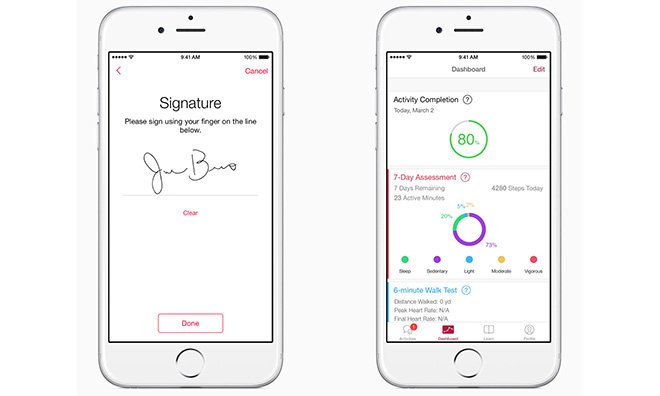

#### Breath Biofeedback Game — Bingham et al. (2010)

- **Link:** https://dl.acm.org/doi/10.1145/3706599.3720103?__cf_chl_tk=stH2Zw5WPh.UULR61oDF9.2uu0ni8M42TBqghke2cOQ-1775971020-1.0.1.1-xcd59Cd6AT38.Eb4dAnIAXWTgg0ou1MH6feEFrvkHFk
- **Público-alvo:** Crianças com Fibrose Cística.
- **Funcionalidades principais:** Biofeedback respiratório integrado a jogo; coleta de dados de sopro durante as sessões.
- **Limitações:** Sistema de pesquisa sem módulo de relatório para clínicos; dados coletados não são transformados em documentação clínica; sem histórico longitudinal por paciente.

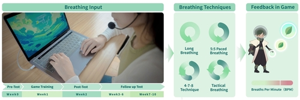

#### MHealth CF Analytics — Vagg et al. (2018)

- **Link:** Literatura científica (IEEE CBMS 2018)
- **Público-alvo:** Adultos com Fibrose Cística e equipes clínicas.
- **Funcionalidades principais:** Analytics de dados de jogo sério respiratório, alertas automáticos por SMS para o paciente, ferramenta web para visualização pela equipe clínica.
- **Limitações:** Não gera narrativa clínica — apresenta apenas dados numéricos e gráficos; alertas são binários, sem texto interpretativo; sem exportação de relatório para o prontuário.

#### Nuance DAX

- **Link:** https://nuance.com
- **Público-alvo:** Médicos e equipes clínicas em geral.
- **Funcionalidades principais:** Transcrição automática de consultas, sumarização de notas clínicas via IA, integração com prontuários eletrônicos.
- **Limitações:** Não integra dados de jogos sérios ou sensores de reabilitação; custo elevado, inviável para projetos de pesquisa; focado em consultas presenciais, não em dados longitudinais de sessões domiciliares.

#### Comparação entre Soluções

| Solução               | Pontos Fortes                                      | Limitações                                              |
| --------------------- | -------------------------------------------------- | ------------------------------------------------------- |
| iHealth Explorer      | Interface simples; histórico gráfico               | Sem narrativa clínica; sem integração com jogos sérios  |
| Apple ResearchKit     | Open source; coleta estruturada de sintomas        | Sem relatório narrativo; inserção manual pelo paciente  |
| Bingham et al.        | Integra sopro ao jogo; coleta dados respiratórios  | Sem módulo de relatório para clínicos                   |
| Vagg et al.           | Analytics de jogo + alertas; ferramenta web clínica| Sem narrativa; alertas binários; sem exportação PDF     |
| Nuance DAX            | Geração de texto clínico via IA de alta qualidade  | Sem integração com jogos sérios; custo inviável         |

#### Diferencial do Projeto

Nenhuma das soluções analisadas integra simultaneamente as três capacidades necessárias para o contexto do I Blue It:

1. **Processamento de logs de jogos sérios respiratórios** — extração e normalização das métricas geradas pelo jogo;
2. **Análise de padrões clínicos** — comparação longitudinal e detecção de deterioração ou melhora;
3. **Geração de relatório narrativo em linguagem natural via LLM** — texto clínico estruturado, em português, adequado para inclusão no prontuário.

Adicionalmente, a solução será **de código aberto**, adaptável por outros grupos de pesquisa que utilizem jogos sérios para reabilitação respiratória, e será desenvolvida com foco no fluxo de trabalho real das equipes clínicas parceiras.

---

### 1.4 Público-Alvo

O sistema será utilizado por **três perfis distintos** de usuários:

- **Fisioterapeuta / Equipe Multidisciplinar:** Profissional de saúde responsável pelo acompanhamento clínico dos pacientes em reabilitação respiratória. Realiza upload dos logs, consulta os relatórios gerados, acompanha a evolução histórica e configura critérios de alerta. É o usuário principal do sistema. Nível técnico: médio — familiaridade com computadores e sistemas web, sem conhecimento de programação ou análise de dados.

- **Técnico de Fisioterapia:** Aplica as sessões com o I Blue It e precisa consultar rapidamente o relatório mais recente e verificar se há alertas ativos antes de iniciar uma sessão. Nível técnico: básico — interface deve ser simples e direta.

- **Pesquisador:** Membro do grupo de pesquisa que acompanha múltiplos pacientes simultaneamente. Necessita de sínteses consolidadas dos dados para análise de eficácia do jogo e produção científica. Nível técnico: alto — confortável com dados estruturados e análises comparativas.

---

### 1.5 Objetivos do Projeto

#### Objetivo Geral

Desenvolver um sistema baseado em Inteligência Artificial que processe automaticamente os logs do exergame I Blue It e gere relatórios clínicos narrativos em linguagem natural, disponibilizados por meio de uma aplicação web para equipes de reabilitação respiratória — eliminando a dependência de interpretação manual dos dados e reduzindo o tempo de documentação clínica.

#### Objetivos Específicos

1. Implementar um pipeline de ingestão, extração e normalização de métricas clínicas a partir dos logs do I Blue It nos formatos JSON e CSV;
2. Desenvolver e iterar prompts de engenharia clínica para geração de texto narrativo via LLM, respeitando a terminologia da fisioterapia respiratória e as necessidades documentais identificadas com o parceiro;
3. Construir uma API de backend que orquestre o processamento dos logs, a chamada ao LLM e o armazenamento dos relatórios gerados;
4. Desenvolver uma interface web para visualização de relatórios por paciente, com histórico gráfico de métricas e sistema de alertas configuráveis por critério clínico;
5. Validar os relatórios gerados junto a pelo menos dois profissionais de saúde do grupo de pesquisa parceiro, por meio de protocolo estruturado de avaliação com escala Likert.

---

### 1.6 Métricas de Sucesso (KPIs)

O projeto será considerado bem-sucedido quando os seguintes critérios forem atendidos:

- **Tempo de geração:** Relatório gerado em até 30 segundos após o upload do log, do início ao fim do processamento pelo backend.
- **Qualidade narrativa:** Avaliação média ≥ 4,0 / 5,0 na escala Likert aplicada a fisioterapeutas avaliadores, considerando clareza, completude e aderência à terminologia clínica.
- **Cobertura de métricas:** 100% das métricas definidas no escopo extraídas corretamente dos logs em todos os formatos suportados.
- **Precisão de alertas:** Taxa de concordância ≥ 85% entre os alertas gerados automaticamente e a avaliação manual de um fisioterapeuta para os mesmos dados.
- **Adoção:** Pelo menos 2 profissionais de saúde do grupo parceiro utilizando o sistema ativamente nos primeiros 30 dias após a implantação do MVP.

---

## 2. Engenharia de Requisitos
 
### 2.1 Personas
 
#### Persona 1 — Dra. Ana, Fisioterapeuta Respiratória
 
Ana tem 34 anos e coordena o acompanhamento de 15 pacientes com DPOC em um programa de reabilitação pulmonar vinculado ao grupo de pesquisa. Utiliza o I Blue It como ferramenta complementar às sessões presenciais e é responsável pela documentação clínica semanal de cada paciente.
 
- **Objetivos:** Documentar a evolução dos pacientes de forma eficiente; identificar rapidamente quem está deteriorando antes da próxima consulta; ter registros claros e padronizados para discussão em equipe multidisciplinar e para fins de pesquisa.
- **Dificuldades:** Perde entre 30 e 45 minutos por semana abrindo arquivos de log manualmente e redigindo relatórios; os dados do jogo raramente entram nos registros clínicos formais por falta de tempo; não consegue visualizar tendências ao longo de semanas sem consolidar vários arquivos.
#### Persona 2 — Prof. Carlos, Pesquisador e Coordenador do Grupo I Blue It
 
Carlos tem 48 anos e coordena o grupo de pesquisa responsável pelo I Blue It. Supervisiona a coleta de dados de múltiplos pacientes em diferentes momentos do estudo e precisa de sínteses para embasar publicações científicas e relatórios de projeto.
 
- **Objetivos:** Obter sínteses consolidadas dos dados coletados; identificar padrões de evolução entre pacientes; gerar evidências quantitativas de eficácia do jogo para publicação.
- **Dificuldades:** Os dados estão distribuídos em logs individuais sem ferramenta de consolidação; a análise manual é inviável para amostras com mais de 10 pacientes; não há histórico visual de evolução por paciente.
#### Persona 3 — João, Técnico de Fisioterapia
 
João tem 27 anos e aplica as sessões com o I Blue It diretamente com os pacientes. Não redige relatórios, mas precisa saber, antes de cada sessão, como o paciente evoluiu na semana anterior e se há algum ponto de atenção registrado.
 
- **Objetivos:** Consultar rapidamente o relatório mais recente do paciente; verificar se há alertas ativos antes de iniciar a sessão.
- **Dificuldades:** Não tem acesso fácil ao histórico; depende de receber informações verbalmente da Dra. Ana, o que nem sempre acontece antes das sessões.
---
 
### 2.2 Casos de Uso Principais
 
1. **UC01 — Upload de log de sessão:** O fisioterapeuta faz upload do arquivo de log gerado pelo I Blue It (JSON ou CSV) para um paciente cadastrado no sistema.
2. **UC02 — Geração de relatório:** O sistema processa o log, extrai as métricas, consulta o histórico do paciente e aciona o LLM para gerar o relatório clínico narrativo.
3. **UC03 — Visualização do relatório:** O profissional acessa e lê o relatório gerado, com destaque automático para alertas ativos.
4. **UC04 — Consulta de histórico:** O profissional visualiza a lista de relatórios anteriores e o gráfico de evolução de métricas de um paciente ao longo do tempo.
5. **UC05 — Exportação de relatório:** O profissional exporta o relatório em PDF para inclusão no prontuário físico ou envio por e-mail.
6. **UC06 — Configuração de alertas:** O profissional configura os critérios de alerta para um paciente específico (métrica, condição e número de registros consecutivos).
7. **UC07 — Cadastro de paciente:** O profissional cadastra um novo paciente no sistema com código interno anonimizado.
---
 
### 2.3 Requisitos Funcionais (RF)
 
**RF01** — O sistema deve permitir que o profissional autenticado cadastre e gerencie pacientes com código interno anonimizado, sem armazenamento de dados identificáveis.
 
**RF02** — O sistema deve permitir que o profissional faça upload de arquivos de log do I Blue It nos formatos JSON e CSV.
 
**RF03** — O sistema deve validar o schema do arquivo de log no momento do upload e exibir mensagem de erro descritiva caso campos obrigatórios estejam ausentes.
 
**RF04** — O sistema deve extrair e armazenar as seguintes métricas de cada sessão: intensidade média e máxima de sopro, tempo total de jogo, tempo efetivo de sopro, pontuação, frequência de uso e respostas ao questionário de bem-estar.
 
**RF05** — O sistema deve gerar automaticamente um relatório clínico narrativo em português a partir das métricas extraídas, utilizando um Large Language Model (LLM) via API.
 
**RF06** — O sistema deve exibir o relatório gerado em interface web acessível ao profissional autenticado, organizado em blocos: resumo da sessão, análise comparativa, indicadores de alerta e dados brutos consolidados.
 
**RF07** — O sistema deve exibir gráfico histórico de pelo menos três métricas principais por paciente, com filtro de período (última semana, último mês, todo o histórico).
 
**RF08** — O sistema deve permitir que o profissional exporte o relatório em formato PDF para inclusão no prontuário.
 
**RF09** — O sistema deve detectar automaticamente critérios de deterioração configuráveis e exibir alertas destacados no relatório e no dashboard do profissional.
 
**RF10** — O sistema deve permitir que o profissional configure os critérios de alerta por paciente, incluindo a métrica monitorada, a condição e o número de registros consecutivos para disparo.
 
**RF11** — O sistema deve manter histórico completo de todos os relatórios gerados por paciente, com data, métricas de referência e indicação de alertas.
 
**RF12** — O sistema deve registrar log de auditoria de todas as gerações de relatório, incluindo timestamp, código do paciente e identificador do usuário responsável.
 
---
 
### 2.4 Requisitos Não Funcionais (RNF)
 
**RNF01** — O tempo total de geração do relatório (do recebimento do log à exibição do texto narrativo) não deve ultrapassar 30 segundos.
 
**RNF02** — O sistema deve estar disponível publicamente via HTTPS com certificado válido.
 
**RNF03** — Os dados dos pacientes devem ser armazenados sem identificação direta — anonimizados por código interno gerado pelo sistema, sem nome, CPF ou quaisquer dados biométricos.
 
**RNF04** — A interface web deve ser responsiva e funcional em desktops e tablets, sem necessidade de instalação de software adicional.
 
**RNF05** — O código-fonte deve ser disponibilizado em repositório público no GitHub sob licença MIT.
 
**RNF06** — O sistema deve suportar múltiplos usuários autenticados simultaneamente sem degradação perceptível de desempenho.
 
**RNF07** — A autenticação deve utilizar tokens JWT com expiração de sessão configurável pelo administrador.
 
**RNF08** — Em caso de falha na API do LLM, o sistema deve armazenar os dados extraídos do log e permitir reprocessamento manual sem necessidade de novo upload.
 
---
 
### 2.5 Regras de Negócio
 
- **RN01:** Apenas profissionais autenticados com perfil clínico ou pesquisador podem acessar dados de pacientes.
- **RN02:** Um relatório só pode ser gerado se o log contiver ao menos as métricas mínimas obrigatórias: intensidade de sopro, tempo de jogo e pontuação. Logs incompletos são rejeitados com mensagem de erro.
- **RN03:** O texto narrativo gerado pelo LLM é classificado como **sugestivo** — o sistema não realiza prescrições clínicas. Todo relatório deve exibir o aviso: *"Este relatório foi gerado automaticamente e deve ser revisado pelo profissional responsável antes de ser incorporado ao prontuário clínico."*
- **RN04:** Um alerta é disparado quando o critério configurado é atingido por **cinco registros consecutivos** por padrão. Esse número pode ser alterado pelo profissional por paciente.
- **RN05:** O histórico de relatórios de um paciente não pode ser excluído pelo usuário — apenas arquivado — preservando o rastro clínico para fins de pesquisa e auditoria.
- **RN06:** No primeiro relatório de um paciente, o sistema gera o texto sem análise comparativa, indicando explicitamente no documento que trata-se da sessão de referência inicial.
---
 
### 2.6 Fora do Escopo
 
- Integração direta com sistemas de prontuário eletrônico (HIS/EHR);
- Geração de relatórios em tempo real durante a sessão de jogo;
- Aplicativo mobile para o profissional de saúde;
- Prescrição ou recomendação clínica automatizada com caráter normativo;
- Suporte a idiomas além do português brasileiro na versão inicial;
- Módulo de comunicação direta com o paciente (notificações, mensagens ou alertas enviados ao paciente);
- Integração com dispositivos físicos de medição respiratória (espirômetros, oxímetros).
---
 
## 3. Fluxos e Comportamento do Sistema
 
### 3.1 Fluxo Principal do Usuário
 
O diagrama abaixo representa o fluxo de atividades do profissional de saúde no sistema, desde o login até a geração e exportação do relatório clínico.
 
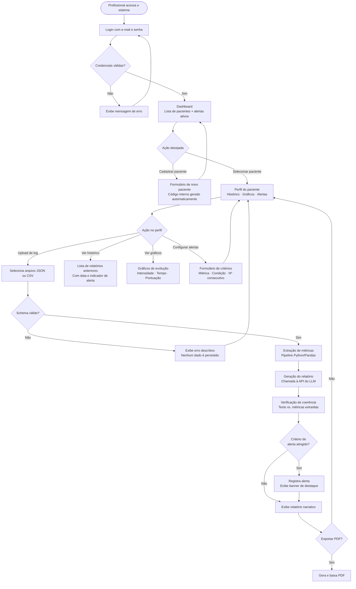
 
---
 
### 3.2 Diagrama de Casos de Uso
 
O diagrama abaixo representa os atores do sistema e os casos de uso associados a cada perfil.
 
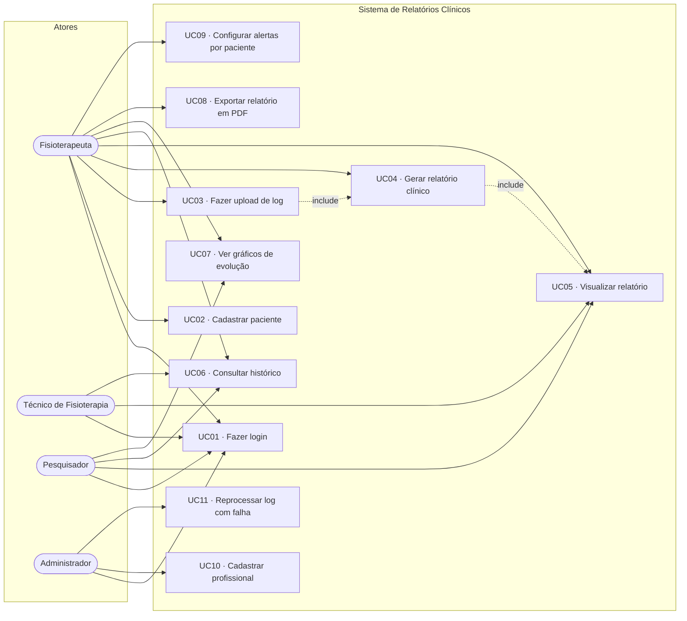
 
---
 
### 3.3 Diagrama de Sequência — Geração de Relatório
 
O diagrama abaixo detalha a comunicação entre os componentes do sistema durante o fluxo principal de upload e geração de relatório.
 
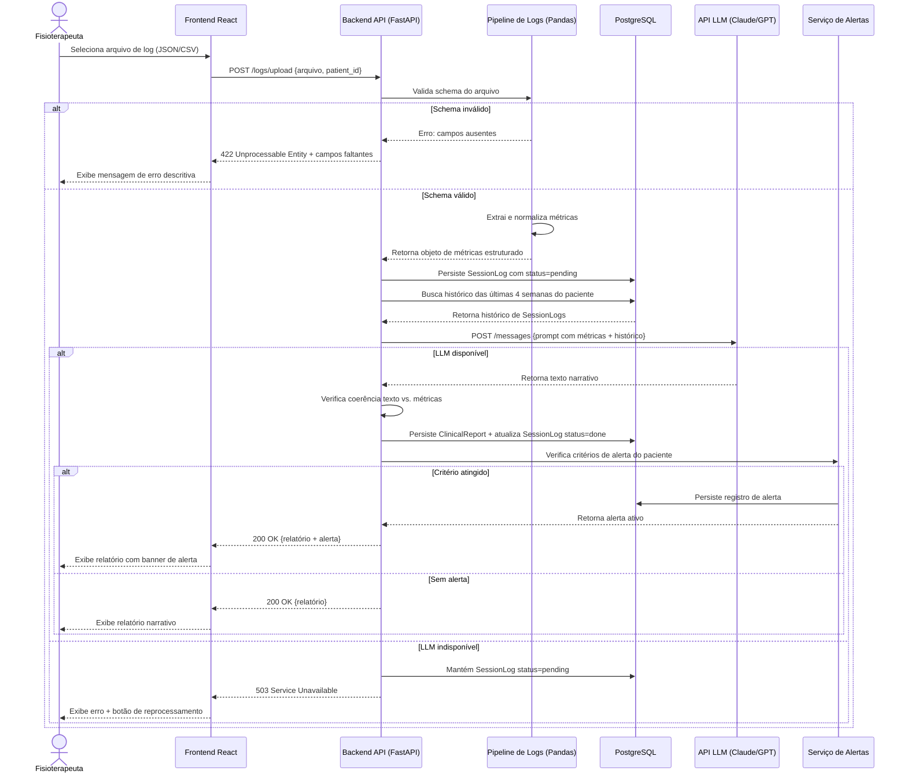
 
---
 
### 3.4 Fluxos Alternativos
 
**FA01 — Log com formato inválido**
O sistema valida o schema do arquivo no momento do upload. Caso o formato seja inválido ou campos obrigatórios estejam ausentes, o upload é rejeitado com HTTP 422 e uma mensagem de erro descritiva é exibida, indicando exatamente quais campos estão faltando. Nenhum dado é persistido no banco.
 
**FA02 — Log parcialmente corrompido**
Se o arquivo possui o schema correto mas contém valores inválidos em campos não obrigatórios (ex.: pontuação negativa, timestamp malformado), o sistema aceita o arquivo, ignora os campos corrompidos, registra um aviso no log de auditoria e prossegue com as métricas válidas disponíveis. O relatório gerado indica quais campos foram descartados.
 
**FA03 — Falha na API do LLM**
Caso a chamada falhe (timeout, erro de autenticação ou indisponibilidade), o sistema mantém o `SessionLog` com `status=pending`, exibe mensagem de falha ao usuário e habilita botão de reprocessamento manual — sem necessidade de novo upload do arquivo.
 
**FA04 — Primeiro relatório do paciente**
Sem histórico anterior, o LLM recebe via prompt a informação de que é a sessão de referência inicial e gera o relatório sem análise comparativa, indicando isso explicitamente no texto.
 
**FA05 — Critério de alerta atingido**
O Serviço de Alertas detecta o critério e persiste o registro. Um banner de destaque é exibido no topo do relatório e uma notificação com link direto aparece no dashboard do profissional responsável.
 
---
 
## 4. Mockups e Experiência do Usuário (UX)
 
Os mockups e protótipos navegáveis do sistema estão disponíveis no Figma:
 
> 🔗 **Protótipo navegável:** [https://www.figma.com/design/tbQyR10uUZVW3RoBAiMhuh/i-blue-it?node-id=2506-90](https://www.figma.com/design/tbQyR10uUZVW3RoBAiMhuh/i-blue-it?node-id=2506-90)
 
As seções abaixo descrevem o fluxo de navegação, as telas principais e o fluxo de interação do usuário com base no protótipo.
 
---
 
### 4.1 Fluxo de Navegação
 
O diagrama abaixo representa como o usuário navega entre as telas do sistema.
 

 
---
 
### 4.2 Wireframes e Mockups das Telas
 
Os mockups completos estão disponíveis no protótipo Figma linkado acima. A seguir, cada tela com sua respectiva imagem e descrição funcional.
 
---
 
**Tela 1 — Login**
 
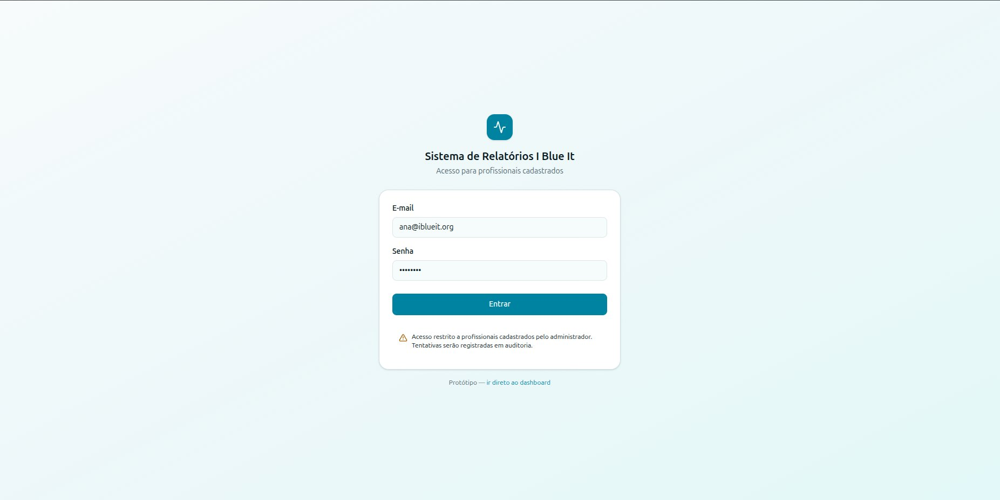
 
Tela de entrada do sistema com campos de e-mail e senha. Autenticação via JWT — sem cadastro público, novos profissionais são cadastrados pelo administrador. O aviso inferior reforça que tentativas de acesso são registradas em auditoria, alinhado ao requisito RNF06.
 
---
 
**Tela 2 — Dashboard**
 
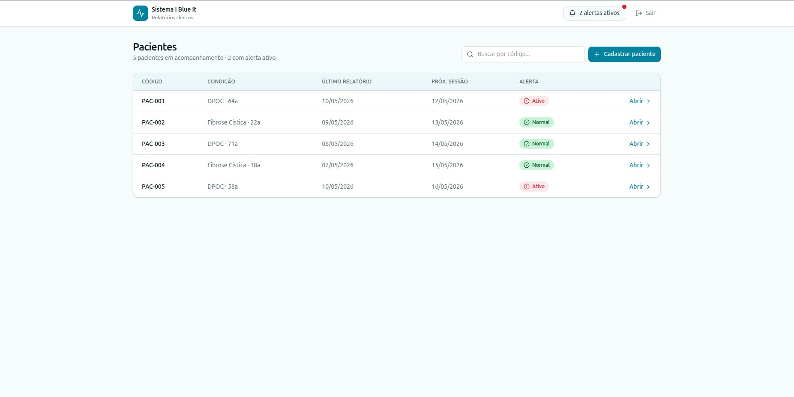
 
Visão geral de todos os pacientes em acompanhamento. Exibe código interno, condição clínica, data do último relatório, próxima sessão e indicador de alerta (🔴 Ativo / 🟢 Normal). O contador de alertas ativos no topo permite acesso rápido às prioridades. Barra de busca por código e botão de cadastro de novo paciente.
 
---
 
**Tela 3 — Cadastro de Paciente**
 
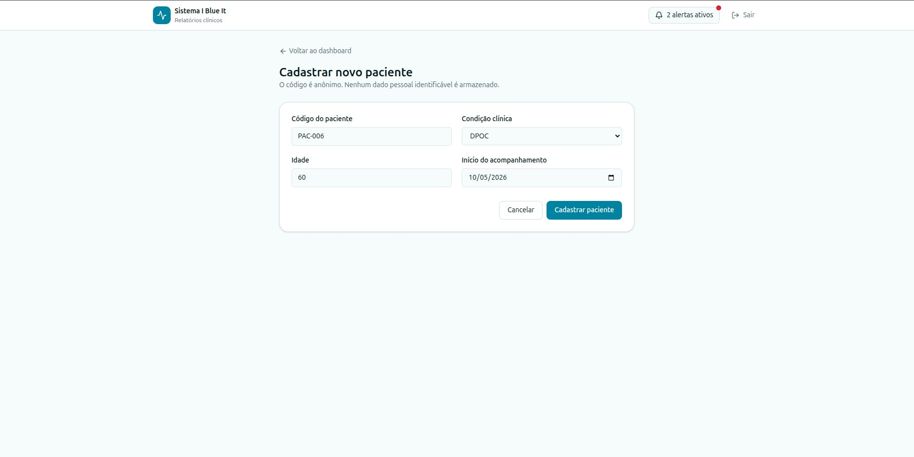
 
Formulário de cadastro com código gerado automaticamente pelo sistema (PAC-XXX), condição clínica (DPOC / Fibrose Cística), idade e data de início do acompanhamento. O subtítulo reforça a política de privacidade: *"O código é anônimo. Nenhum dado pessoal identificável é armazenado."*
 
---
 
**Tela 4 — Relatório Atual**
 
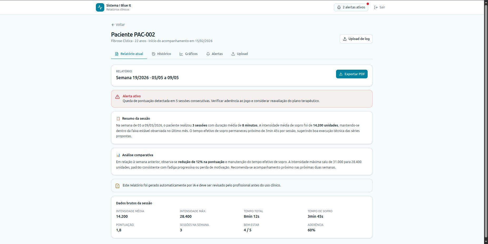
 
Tela central do sistema. Exibe o relatório gerado pelo LLM organizado em blocos visuais distintos: banner de **Alerta ativo** (quando presente, em vermelho), **Resumo da sessão**, **Análise comparativa** e **Aviso de revisão clínica** gerado automaticamente. Ao final, tabela de dados brutos com todas as métricas da sessão (intensidade média/máxima, tempo total, tempo de sopro, pontuação, bem-estar e aderência). Botão **Exportar PDF** no canto superior direito.
 
---
 
**Tela 5 — Histórico de Relatórios**
 
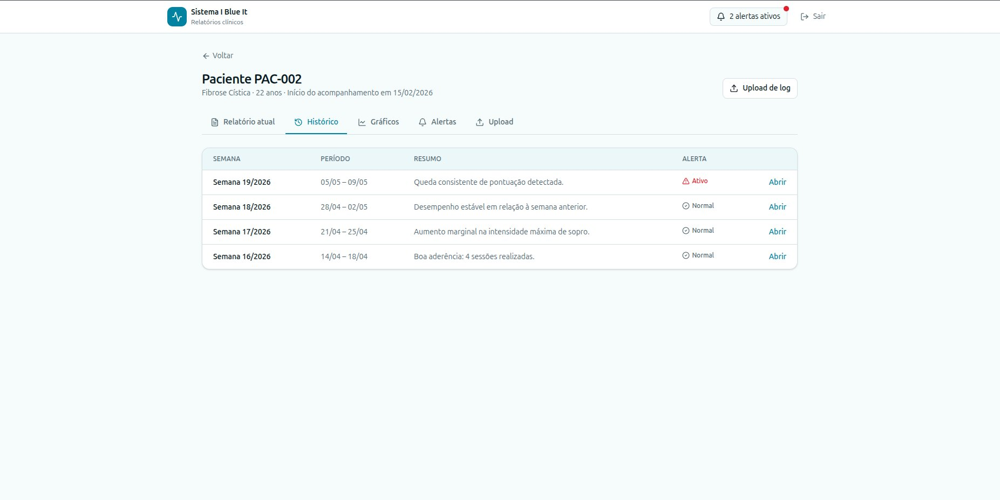
 
Lista cronológica de todos os relatórios gerados para o paciente, com semana de referência, período, resumo da análise e indicador de alerta. Cada linha possui link **Abrir** para visualizar o relatório completo daquela semana.
 
---
 
**Tela 6 — Gráficos de Evolução**
 
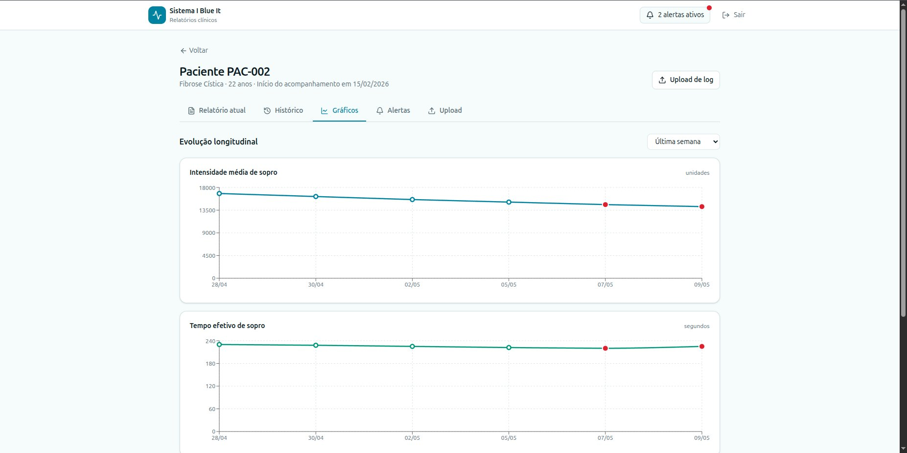
 
Gráficos de linha com evolução longitudinal das métricas principais: **Intensidade média de sopro** (em unidades) e **Tempo efetivo de sopro** (em segundos). Pontos em vermelho indicam sessões com alerta ativo. Filtro de período no canto superior direito (Última semana / Último mês / Todo o histórico).
 
---
 
**Tela 7 — Configuração de Alertas**
 
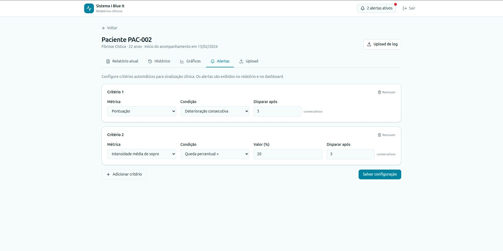
 
Formulário de critérios de alerta configuráveis por paciente. Cada critério define: **Métrica** (ex.: Pontuação, Intensidade média de sopro), **Condição** (Deterioração consecutiva, Queda percentual) e **Disparar após** N registros consecutivos. Permite adicionar múltiplos critérios e removê-los individualmente. Botão **Salvar configuração** confirma as alterações.
 
---
 
**Tela 8 — Upload de Log**
 
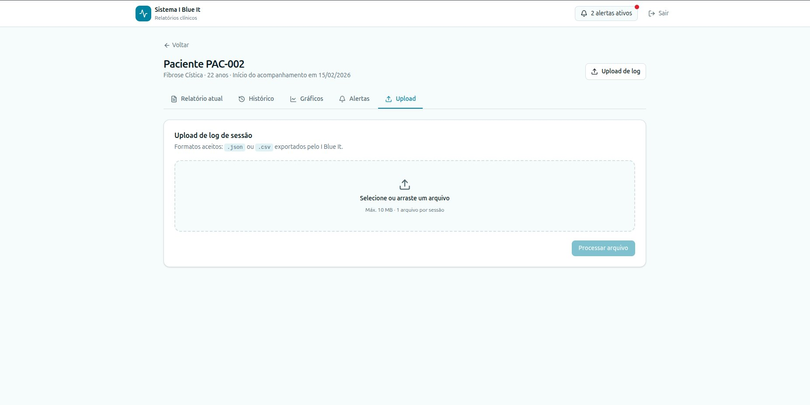
 
Área de upload com drag-and-drop para arquivos `.json` ou `.csv` exportados pelo I Blue It. Limite de 10 MB por arquivo e 1 arquivo por sessão. Botão **Processar arquivo** aciona o pipeline de extração de métricas e geração do relatório.
 
---
 
### 4.3 Fluxo de Interação do Usuário — Upload e Geração de Relatório
 
1. O profissional acessa o perfil do paciente desejado a partir do dashboard;
2. Clica no botão **Upload de novo log** e seleciona o arquivo JSON ou CSV gerado pelo I Blue It;
3. O sistema valida o formato do arquivo — mensagem de erro imediata e descritiva em caso de problema, com indicação dos campos ausentes;
4. Uma barra de progresso exibe as etapas em sequência: *"Validando arquivo..."* → *"Extraindo métricas..."* → *"Gerando relatório..."* → *"Verificando consistência..."*;
5. O relatório é exibido automaticamente na aba **Relatório Atual** ao final do processamento;
6. Caso algum critério de alerta configurado tenha sido atingido, um banner de destaque aparece no topo da página antes do texto do relatório;
7. O profissional lê, revisa o conteúdo e, se necessário, clica em **Exportar PDF** para gerar o documento para o prontuário.
---
 
## 5. Arquitetura do Sistema
 
### 5.1 Diagrama C4
 
#### Nível 1 — Diagrama de Contexto
 
O sistema é acessado por três perfis de usuários humanos e depende de um serviço externo (API do LLM) para a geração do texto narrativo. Nenhum dado identificável do paciente é enviado ao serviço externo.
 
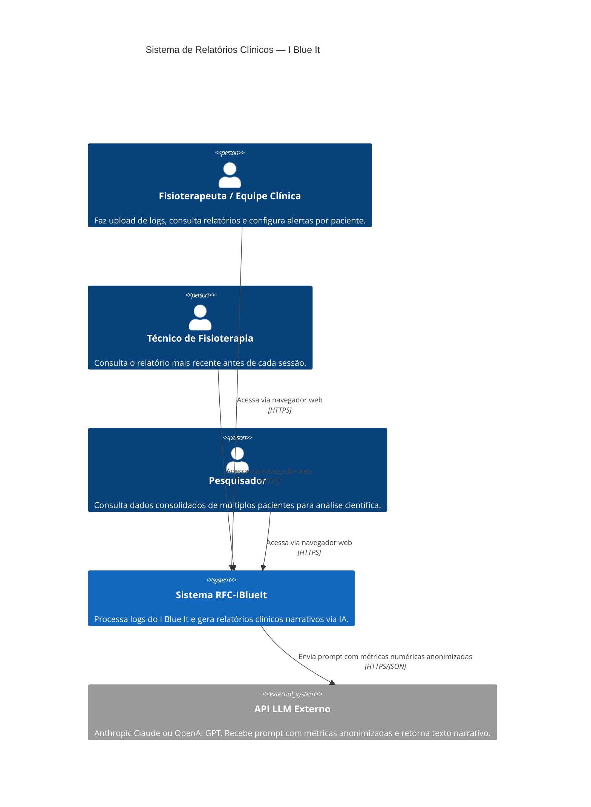
 
#### Nível 2 — Diagrama de Containers
 
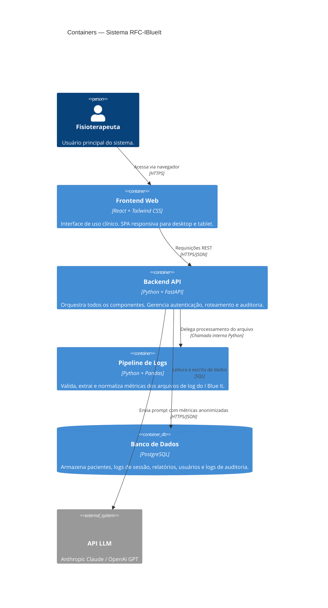
 
#### Nível 3 — Diagrama de Componentes (Backend API)
 
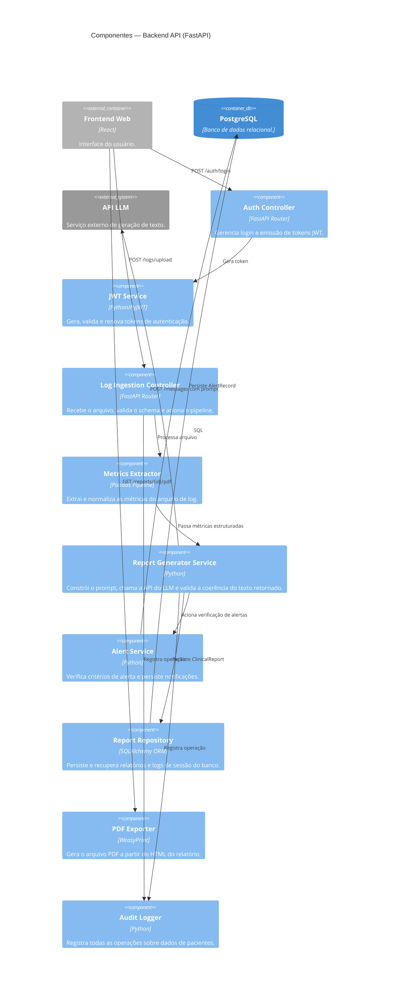
 
---
 
### 5.2 Modelo de Dados
 
#### Diagrama Entidade-Relacionamento
 
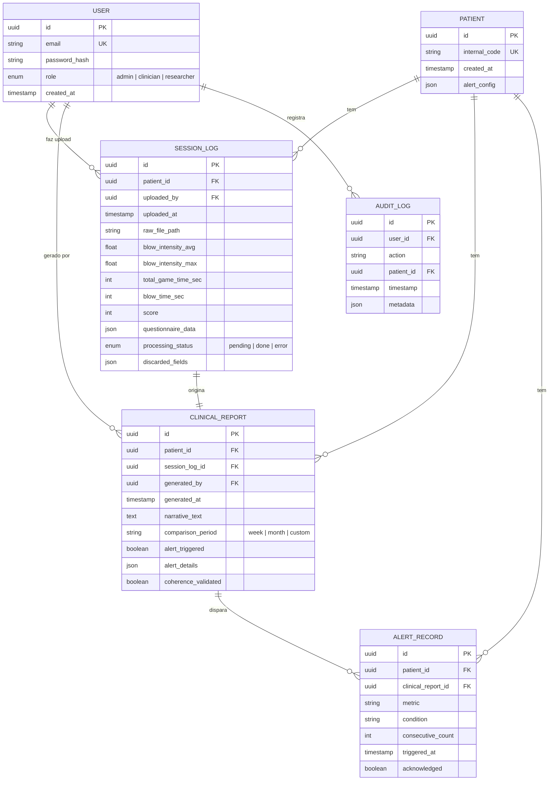
 
---
 
### 5.3 Principais Componentes
 
**Pipeline de Logs**
Módulo Python responsável por validar o schema do arquivo recebido, extrair as métricas definidas (intensidade de sopro, tempos, pontuação, questionário), normalizar os valores para o formato interno e gerar o objeto estruturado que alimenta o motor de geração. Campos corrompidos ou ausentes são registrados em `discarded_fields` e reportados ao usuário. Suporta JSON e CSV.
 
**Motor de Geração de Relatórios**
Componente central do sistema. Recebe os dados estruturados da sessão atual, consulta o histórico do paciente com granularidade semanal (padrão) ou configurável, constrói o prompt clínico via template parametrizado e realiza a chamada à API do LLM. O texto retornado passa por verificação de coerência — confrontando as afirmações do texto com as métricas numéricas — antes de ser persistido.
 
**Serviço de Alertas**
Após cada geração de relatório, compara as métricas da nova sessão com o histórico e verifica se os critérios configurados para o paciente foram atingidos. Persiste o `AlertRecord` e atualiza o indicador no dashboard.
 
**API REST (FastAPI)**
Orquestra todos os componentes internos, gerencia autenticação JWT, valida as entradas de cada endpoint, registra o log de auditoria e expõe os endpoints consumidos pelo frontend.
 
**Frontend React**
Interface de uso clínico com foco em simplicidade e baixa curva de aprendizado. Consome a API via HTTPS e renderiza relatórios, gráficos de evolução e alertas visuais.
 
---
 
### 5.4 Stack Tecnológica
 
**Python + FastAPI**
Escolhido pela integração natural com o ecossistema de ciência de dados (Pandas, NumPy) necessário para o pipeline de processamento de logs, e pela alta produtividade para construção de APIs REST com tipagem e documentação automática via OpenAPI.
 
**Pandas + NumPy**
Padrão de mercado para extração, transformação e normalização de dados estruturados em Python. Permite lidar com variações de formato dos arquivos de log com mínima configuração adicional.
 
**API LLM — Anthropic Claude Haiku ou OpenAI GPT-4o-mini**
Ambos os modelos oferecem excelente relação custo-benefício para geração de texto narrativo em domínio especializado, suportam prompts longos e estruturados e apresentam boa aderência a instruções de estilo e terminologia. Para um projeto acadêmico, o custo estimado por relatório gerado é inferior a R$ 0,05.
 
**PostgreSQL**
Banco de dados relacional robusto, adequado para dados clínicos estruturados com relacionamentos claros entre entidades. Suporte nativo ao tipo JSON permite armazenar configurações de alerta e dados de questionário sem necessidade de schema rígido para esses campos.
 
**React + Tailwind CSS**
Desenvolvimento ágil de interfaces responsivas com consistência visual sem overhead de CSS customizado. A abordagem utility-first do Tailwind acelera a prototipação e facilita manutenção.
 
**WeasyPrint**
Biblioteca Python para geração de PDFs a partir de HTML e CSS, sem dependência de serviços externos ou binários adicionais. Permite aplicar o mesmo template visual da interface web ao documento exportado.
 
**Railway ou Render**
Plataformas de deploy cloud com suporte nativo a Python e PostgreSQL, plano gratuito adequado para projetos acadêmicos e configuração simplificada via repositório GitHub.
 
**JWT (JSON Web Tokens)**
Padrão amplamente adotado para autenticação stateless em APIs REST. Elimina a necessidade de gerenciamento de sessão no servidor e facilita a escalabilidade horizontal futura.
 
---
 
## 6. Segurança e Privacidade
 
O sistema foi projetado desde o início com privacidade por design. **Nenhum dado que permita identificação direta do paciente é armazenado** — nome, CPF, data de nascimento, endereço ou qualquer dado biométrico. Toda referência a pacientes é feita por código interno gerado automaticamente pelo sistema.
 
**Medidas de segurança implementadas:**
 
- Autenticação obrigatória via JWT para todas as rotas, exceto `/health`;
- Tokens JWT com expiração configurável (padrão: 8 horas);
- Comunicação exclusivamente via HTTPS com certificado válido;
- Senhas armazenadas com hash bcrypt e salt único por usuário;
- Log de auditoria imutável para todas as operações sobre dados de pacientes;
- Validação e sanitização de entrada em todos os endpoints (prevenção contra injeção SQL e payloads maliciosos);
- Arquivos de log armazenados em diretório isolado no servidor, sem acesso direto via URL pública;
- Apenas dados numéricos agregados — sem qualquer identificador do paciente — são enviados à API do LLM.
  
### 6.1 Privacidade e LGPD
 
**Dados coletados:** Métricas numéricas de desempenho em sessões de jogo (intensidade de sopro, tempos, pontuação) e respostas a questionários de bem-estar, todos identificados apenas por código interno. Dados de acesso dos profissionais (e-mail e hash de senha).
 
**Armazenamento:** Banco de dados PostgreSQL hospedado em servidor com acesso restrito. Backups automáticos com retenção de 30 dias. Nenhum dado de paciente é compartilhado com terceiros além da API do LLM, e mesmo assim apenas métricas numéricas agregadas são enviadas.
 
**Direito de remoção (Art. 18 da LGPD):** O administrador do sistema pode arquivar os dados de um paciente mediante solicitação. A remoção definitiva é executada mediante solicitação formal ao responsável técnico, com prazo de resposta de até 72 horas, e documentada no log de auditoria.
 
---

## 7. Planejamento do Projeto
 
| Marco | Descrição                                                                                  | Prazo       |
| ----- | ------------------------------------------------------------------------------------------ | ----------- |
| M1    | Setup do ambiente, mapeamento do formato dos logs do I Blue It, definição do schema de dados | Semana 1–2  |
| M2    | Pipeline de processamento de logs funcional — extração e normalização de todas as métricas | Semana 3–5  |
| M3    | Integração com API do LLM e geração de relatório de prova de conceito                     | Semana 6–7  |
| M4    | MVP funcional: backend completo + frontend com upload, geração e visualização              | Semana 8–10 |
| M5    | Validação com profissionais de saúde — Etapa 1: sessão de feedback estruturado            | Semana 11   |
| M6    | Ajustes pós-validação, sistema de alertas e exportação PDF                                 | Semana 12   |
| M7    | Validação com dados reais anonimizados — Etapa 2                                           | Semana 13   |
| M8    | Documentação final, testes, deploy público e entrega                                       | Semana 14   |
 
---
 
## 8. Referências
 
AGUILAR, J. G. et al. **Respiration Tracking Using the Wii Remote Game-Controller**. In: *Proceedings of Medical Informatics in a United and Healthy Europe*, 2011. p. 455–459.
 
DIAS, C. et al. **Uso da Inteligência Artificial em Jogos Digitais aplicados à Reabilitação Respiratória: um Mapeamento Sistemático da Literatura**. UDESC, 2020.
 
DIAS, C. et al. **A MM Its Use in Respiratory Rehabilitation**. UDESC, 2023.
 
DIAS, C. **Tese de Doutorado — publicada**. UDESC, 2024.
 
GRIMES, D. et al. **O Processo de Design de um Sistema Biomédico com Jogo Sério e Dispositivo**. 2018.
 
GRIMES, D. et al. **Sistema biomédico (com jogo sério e dispositivo especial) para reabilitação respiratória**. 2018.
 
NERY, F. et al. **123-SGR: Uma Arquitetura para Jogos Sérios Multimodais para Reabilitação**. UDESC, 2020.
 
SANTOS, R. et al. **I Blue It: Um Jogo Sério para auxiliar na Reabilitação Respiratória**. UDESC, 2018.
 
SANTOS, R. et al. **Estendendo Jogos Sérios com a perspectiva de Serviço**. UDESC, 2020.
 
VAGG, T. et al. **MHealth and Serious Game Analytics for Cystic Fibrosis Adults**. In: *2018 IEEE 31st International Symposium on Computer-Based Medical Systems*, 2018. p. 100–105. DOI: 10.1109/CBMS.2018.00025.
 
---
 
## 9. Apêndices
 
### Apêndice A — Estrutura do Relatório Narrativo Gerado
 
Cada relatório clínico gerado automaticamente pelo sistema é composto pelos seguintes blocos, nesta ordem:
 
1. **Identificação** — código do paciente, data de geração do relatório e período de referência (semana/mês);
2. **Resumo da sessão** — síntese em 2 a 3 parágrafos do desempenho registrado na(s) sessão(ões) do período;
3. **Análise comparativa** — comparação com os períodos anteriores, com identificação explícita de tendências de melhora ou deterioração;
4. **Indicadores de alerta** — quando presentes, destacados visualmente com descrição do critério atingido e número de ocorrências consecutivas;
5. **Aviso de revisão** — texto fixo: *"Este relatório foi gerado automaticamente por sistema de IA e deve ser revisado pelo profissional responsável antes de ser incorporado ao prontuário clínico."*;
6. **Dados brutos consolidados** — tabela com todas as métricas numéricas da(s) sessão(ões) do período para referência do profissional.
### Apêndice B — Repositório e Licença
 
O código-fonte do projeto será disponibilizado em repositório público no GitHub sob licença MIT, conforme exigência da modalidade "Projeto voltado à Comunidade" definida no Playbook do Portfólio da Católica SC.
 
- **Playbook do Portfólio:** https://github.com/CatolicaSC-Portfolio/The-Portfolio-Playbook
- **Repositório do projeto:** https://github.com/Jhssic/iblueit-clinical-reports.git
---
 
## 10. Parecer do Comitê de Avaliação
 
*(A ser preenchido pelos professores avaliadores da RFC)*
 
**Avaliador 1:** __________________________
**Status:** [ ] Aprovado [ ] Ajustar
 
**Observações:**
 
---
 
**Avaliador 2:** __________________________
**Status:** [ ] Aprovado [ ] Ajustar
 
**Observações:**
 
---
 
**Avaliador 3:** __________________________
**Status:** [ ] Aprovado [ ] Ajustar
 
**Observações:**
 
